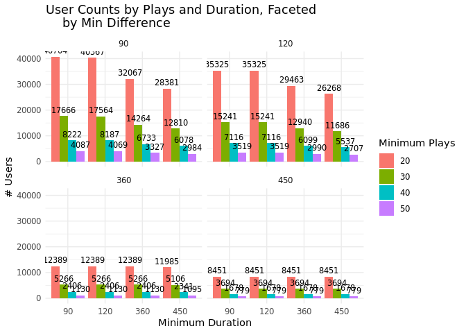
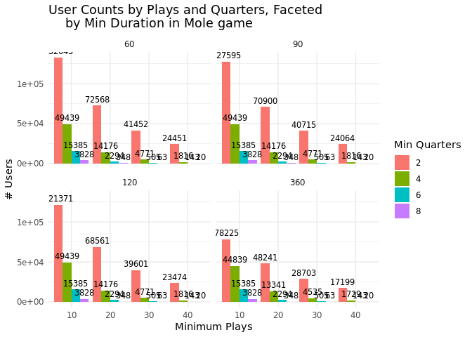
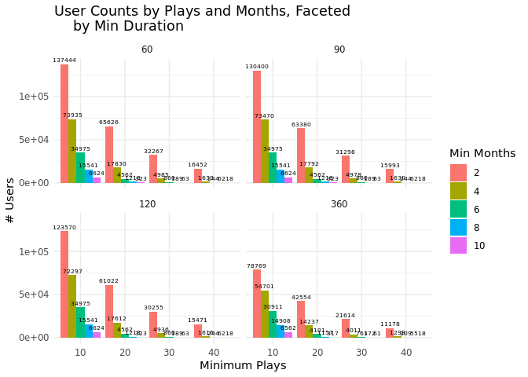

WMLongitudinal_Data
================

# Content

In this document we investigate how much time series data we have for
students. - How many students played frequently for a long time? - How
many students played significantly at one point and then played again
later in development?

# Load Data

# Number Game

The following code takes time so I run and saved it to use later. So,
they’re commented.

``` r
# logs_66$year <- format(as.Date(logs_66$created), "%Y")

#Some students play for several years so we get the year and user and put them together to work on the later.
# logs_66_grade <- logs_66 %>%
#   filter(grade %in% c(3, 4, 5, 6, 7, 8)) %>%
#   mutate(userid_year = paste0(user_id, "-", year)) #hack for easier filtering


# logs_66_grade <- logs_66_grade %>%
#   mutate(created_date = as.Date(created),
#          quarter = paste(year(created_date), quarter(created_date), sep = "-Q"))


#add set size 
# items$answer_options_clean <-
#    sapply(regmatches(items$answer_options, gregexpr("[0-9]", items$answer_options)), paste, collapse = "")

# items_66 <- items %>% 
#   filter(domain_id == 66) %>% 
#   mutate(item_id = id) %>% 
#   mutate(set_size = nchar(answer_options_clean)) %>% 
#   select(item_id, set_size)

# logs_number <- merge(logs_66_grade, items_66, by = "item_id")

#make a unique month variable
# logs_number <- logs_number %>%
#   mutate(created_date = as.Date(created),
#          year_month = format(created_date, "%Y-%m"))

#make duration variable (the time between their first and last recorded activity)
# duration_user <- logs_number %>% 
#   group_by(user_id) %>% 
#   summarise(start = min(created_date), end= max(created_date)) %>% 
#   mutate(duration = end -start) %>% 
#   ungroup() 

# duration_user <- duration_user %>% 
#   select(user_id, duration)

# logs_number <- merge(logs_number, duration_user, by = "user_id")

#saveRDS(logs_number, file="~/code_seyma/WMDevelopmentProject/data/logs_number.rds")
```

## Student Selection

``` r
#functions for student selection 

filter_users_by_plays_and_quarters <- function(data, 
                                               min_plays = 30, 
                                               min_quarters = 8, #we have total of 16 quarters
                                               excl_quarters = c(),
                                               min_duration = 90) 
  {
  data %>%
    filter(!quarter %in% excl_quarters ) %>% #excluded times, we may want to have smaller time interval
    filter( duration >= min_duration  ) %>% # filter for the duration students played the game
    group_by(user_id, quarter) %>%
    filter(n() >= min_plays) %>%  # Ensure at least `min_plays` plays in each quarter
    ungroup() %>%
    group_by(user_id) %>%
    summarise(unique_quarters = n_distinct(quarter), .groups = "drop") %>%
    filter(unique_quarters >= min_quarters ) %>% #At least `min_quarters` distinct quarters
    summarise(n_users = n(), .groups = "drop") %>%
    pull(n_users)
}

filter_users_by_plays_and_months <- function(data, 
                                               min_plays = 10, 
                                               min_months = 8,
                                               excl_month = c(),
                                             min_duration = 90) 
{
  data %>%
    filter(!year_month %in% excl_month ) %>% #excluded times, we may want to have smaller time interval
    filter( duration >= min_duration  ) %>% # filter for the duration students played the game
    group_by(user_id, year_month) %>%
    filter(n() >= min_plays) %>%  # Ensure at least `min_plays` plays in each month
    ungroup() %>%
    group_by(user_id) %>%
    summarise(unique_month = n_distinct(year_month), .groups = "drop") %>%
    filter(unique_month >= min_months) %>%  # At least `min_quarters` distinct month
    select(user_id) %>% 
    nrow()
}


#Played the game intensely (many plays and long total duration) in one month, but then had long breaks between these intense sessions:
infrequent_intense_users <- function(data, 
                                             min_plays = 40, #minimum number plays given year_month to count as an intense user.
                                             min_duration = 90, #min at least 90 days between first and last activity of students
                                     min_difference = 90) #minimum number of days between intense months. 
{
  result <- data %>%
    filter( duration >= min_duration  ) %>% # filter for the duration students played the game
    group_by(user_id, year_month) %>%
    filter(n() >= min_plays) %>%  # filter for months for at least `min_plays` plays
    ungroup() %>%
    group_by(user_id, year_month) %>%
    summarise(last_day_month = max(created)) %>% 
    ungroup() %>% 
    # Arrange each user's entries by the last_day_month to ensure chronological order
    arrange(user_id, last_day_month) %>%
    # Group by user to compute differences within each user
    group_by(user_id) %>%
    # Calculate the time difference using lag()
    mutate(
      days_since_previous = as.numeric(
        difftime(last_day_month, lag(last_day_month), units = "days")
      )
    ) %>%
    ungroup() %>% 
    group_by(user_id, days_since_previous) %>% 
    filter(days_since_previous >= min_difference) %>% 
    ungroup() %>% 
    select(user_id) %>% 
    distinct() %>%  # Get unique user_ids
    summarise(count = n())  # Count the unique users
  return(result$count)  # Return just the count
}
```

``` r
filtered_user_q <- filter_users_by_plays_and_quarters(logs_number)
filtered_user_q
```

    ## [1] 19

``` r
differnce_user_month <- infrequent_intense_users(logs_number)
```

    ## `summarise()` has grouped output by 'user_id'. You can override using the
    ## `.groups` argument.

``` r
differnce_user_month
```

    ## [1] 1782

### Table

We need a table showing how much students we have for the student
selection we want. Start from strict to lenient Table: min_play,
min_quarter, number_student, min_duration

#### Month-Intense-Dif

``` r
#####Month-Intense-Dif##########
# param_grid <- expand.grid(
#   min_plays = c(20, 30, 40, 50),
#   min_difference = c(90, 120, 360, 450),
#   min_duration = c(90, 120, 360, 450)
# )

# Apply the function over each row of parameter combinations
# results_diff_month <- param_grid %>%
#   mutate(
#     n_users = pmap_dbl(list(min_plays, min_difference, min_duration), 
#                        ~ infrequent_intense_users(data = logs_number, 
#                                                             min_plays = ..1, 
#                                                             min_difference = ..2, 
#                                                             min_duration = ..3))
#  )

#saveRDS(results_diff_month, file="~/code_seyma/WMDevelopmentProject/data/results_diff_month.rds")
results_diff_month <- readRDS(file="~/code_seyma/WMDevelopmentProject/data/results_diff_month.rds")
```

``` r
results_diff_month
```

    ##    min_plays min_difference min_duration n_users
    ## 1         20             90           90   14079
    ## 2         30             90           90    4509
    ## 3         40             90           90    1782
    ## 4         50             90           90     820
    ## 5         20            120           90   11917
    ## 6         30            120           90    3812
    ## 7         40            120           90    1497
    ## 8         50            120           90     689
    ## 9         20            360           90    3329
    ## 10        30            360           90     925
    ## 11        40            360           90     347
    ## 12        50            360           90     140
    ## 13        20            450           90    2268
    ## 14        30            450           90     616
    ## 15        40            450           90     229
    ## 16        50            450           90      92
    ## 17        20             90          120   13950
    ## 18        30             90          120    4484
    ## 19        40             90          120    1768
    ## 20        50             90          120     817
    ## 21        20            120          120   11917
    ## 22        30            120          120    3812
    ## 23        40            120          120    1497
    ## 24        50            120          120     689
    ## 25        20            360          120    3329
    ## 26        30            360          120     925
    ## 27        40            360          120     347
    ## 28        50            360          120     140
    ## 29        20            450          120    2268
    ## 30        30            450          120     616
    ## 31        40            450          120     229
    ## 32        50            450          120      92
    ## 33        20             90          360    9793
    ## 34        30             90          360    3219
    ## 35        40             90          360    1267
    ## 36        50             90          360     574
    ## 37        20            120          360    8782
    ## 38        30            120          360    2844
    ## 39        40            120          360    1109
    ## 40        50            120          360     502
    ## 41        20            360          360    3329
    ## 42        30            360          360     925
    ## 43        40            360          360     347
    ## 44        50            360          360     140
    ## 45        20            450          360    2268
    ## 46        30            450          360     616
    ## 47        40            450          360     229
    ## 48        50            450          360      92
    ## 49        20             90          450    8345
    ## 50        30             90          450    2799
    ## 51        40             90          450    1124
    ## 52        50             90          450     501
    ## 53        20            120          450    7522
    ## 54        30            120          450    2492
    ## 55        40            120          450     983
    ## 56        50            120          450     440
    ## 57        20            360          450    3137
    ## 58        30            360          450     890
    ## 59        40            360          450     336
    ## 60        50            360          450     137
    ## 61        20            450          450    2268
    ## 62        30            450          450     616
    ## 63        40            450          450     229
    ## 64        50            450          450      92

``` r
ggplot(results_diff_month, aes(x = factor(min_duration), y = n_users, fill = factor(min_plays))) +
  geom_col(position = "dodge") + 
  geom_text(aes(label = n_users), position = position_dodge(width = 0.9), vjust = -0.5, size = 3) +
  facet_wrap(~ min_difference) +
  labs(
    title = "User Counts by Plays and Duration, Faceted 
    by Min Difference",
    x = "Minimum Duration", #Min days for game activity
    y = "# Users",
    fill = "Minimum Plays" 
  ) +
  theme_minimal()
```

<!-- -->
\#### Quarter

``` r
######Quarter############
# Create a grid of parameter combinations
# param_grid <- expand.grid(
#   min_plays = c(10, 20, 30, 40),
#   min_quarters = c(2, 4, 6, 8),
#   min_duration = c(60, 90, 120, 360)
# )

# Apply the function over each row of parameter combinations
# results_quarter <- param_grid %>%
#   mutate(
#     n_users = pmap_dbl(list(min_plays, min_quarters, min_duration), 
#                        ~ filter_users_by_plays_and_quarters(data = logs_number, 
#                                                             min_plays = ..1, 
#                                                             min_quarters = ..2, 
#                                                             min_duration = ..3))
#   )

#saveRDS(results_quarter, file="~/code_seyma/WMDevelopmentProject/data/results_quarter.rds")
results_quarter <- readRDS(file="~/code_seyma/WMDevelopmentProject/data/results_quarter.rds")
```

``` r
print(results_quarter)
```

    ##    min_plays min_quarters min_duration n_users
    ## 1         10            2           60   78293
    ## 2         20            2           60   32871
    ## 3         30            2           60   15927
    ## 4         40            2           60    8558
    ## 5         10            4           60   16587
    ## 6         20            4           60    3421
    ## 7         30            4           60    1048
    ## 8         40            4           60     417
    ## 9         10            6           60    2818
    ## 10        20            6           60     365
    ## 11        30            6           60     113
    ## 12        40            6           60      46
    ## 13        10            8           60     507
    ## 14        20            8           60      57
    ## 15        30            8           60      19
    ## 16        40            8           60       8
    ## 17        10            2           90   73959
    ## 18        20            2           90   31595
    ## 19        30            2           90   15408
    ## 20        40            2           90    8286
    ## 21        10            4           90   16587
    ## 22        20            4           90    3421
    ## 23        30            4           90    1048
    ## 24        40            4           90     417
    ## 25        10            6           90    2818
    ## 26        20            6           90     365
    ## 27        30            6           90     113
    ## 28        40            6           90      46
    ## 29        10            8           90     507
    ## 30        20            8           90      57
    ## 31        30            8           90      19
    ## 32        40            8           90       8
    ## 33        10            2          120   69939
    ## 34        20            2          120   30392
    ## 35        30            2          120   14950
    ## 36        40            2          120    8072
    ## 37        10            4          120   16587
    ## 38        20            4          120    3421
    ## 39        30            4          120    1048
    ## 40        40            4          120     417
    ## 41        10            6          120    2818
    ## 42        20            6          120     365
    ## 43        30            6          120     113
    ## 44        40            6          120      46
    ## 45        10            8          120     507
    ## 46        20            8          120      57
    ## 47        30            8          120      19
    ## 48        40            8          120       8
    ## 49        10            2          360   40143
    ## 50        20            2          360   18725
    ## 51        30            2          360    9440
    ## 52        40            2          360    5161
    ## 53        10            4          360   13941
    ## 54        20            4          360    2944
    ## 55        30            4          360     897
    ## 56        40            4          360     357
    ## 57        10            6          360    2818
    ## 58        20            6          360     365
    ## 59        30            6          360     113
    ## 60        40            6          360      46
    ## 61        10            8          360     507
    ## 62        20            8          360      57
    ## 63        30            8          360      19
    ## 64        40            8          360       8

So there are 78293 students who played the games at least 2 months and
played at least one session in each two quarter.

``` r
ggplot(results_quarter, aes(x = factor(min_plays), y = n_users, fill = factor(min_quarters))) +
  geom_col(position = "dodge") +
  geom_text(aes(label = n_users), position = position_dodge(width = 0.9), vjust = -0.5, size = 3) +
  facet_wrap(~ min_duration) +
  labs(
    title = "User Counts by Plays and Quarters, Faceted 
    by Min Duration",
    x = "Minimum Plays", #min play for each unique quarter  
    y = "# Users",
    fill = "Min Quarters"
  ) +
  theme_minimal()
```

<!-- -->

#### Month

``` r
######Month############
# Create a grid of parameter combinations
# param_grid <- expand.grid(
#   min_plays = c(10, 20, 30, 40),
#   min_months = c(2, 4, 6, 8, 10),
#   min_duration = c(60, 90, 120, 360)
# )

# Apply the function over each row of parameter combinations
# results_month <- param_grid %>%
#   mutate(
#     n_users = pmap_dbl(list(min_plays, min_months, min_duration), 
#                        ~ filter_users_by_plays_and_months(data = logs_number, 
#                                                             min_plays = ..1, 
#                                                             min_months = ..2, 
#                                                             min_duration = ..3))
#   )

#saveRDS(results_month, file="~/code_seyma/WMDevelopmentProject/data/ results_month.rds")
results_month <- readRDS( file="~/code_seyma/WMDevelopmentProject/data/results_month.rds")
```

``` r
print(results_month)
```

    ##    min_plays min_months min_duration n_users
    ## 1         10          2           60   83070
    ## 2         20          2           60   28828
    ## 3         30          2           60   10949
    ## 4         40          2           60    4862
    ## 5         10          4           60   31429
    ## 6         20          4           60    5736
    ## 7         30          4           60    1458
    ## 8         40          4           60     527
    ## 9         10          6           60   11250
    ## 10        20          6           60    1369
    ## 11        30          6           60     314
    ## 12        40          6           60     122
    ## 13        10          8           60    3983
    ## 14        20          8           60     376
    ## 15        30          8           60      98
    ## 16        40          8           60      37
    ## 17        10         10           60    1401
    ## 18        20         10           60     117
    ## 19        30         10           60      36
    ## 20        40         10           60      20
    ## 21        10          2           90   77092
    ## 22        20          2           90   27271
    ## 23        30          2           90   10395
    ## 24        40          2           90    4607
    ## 25        10          4           90   31023
    ## 26        20          4           90    5708
    ## 27        30          4           90    1452
    ## 28        40          4           90     526
    ## 29        10          6           90   11250
    ## 30        20          6           90    1369
    ## 31        30          6           90     314
    ## 32        40          6           90     122
    ## 33        10          8           90    3983
    ## 34        20          8           90     376
    ## 35        30          8           90      98
    ## 36        40          8           90      37
    ## 37        10         10           90    1401
    ## 38        20         10           90     117
    ## 39        30         10           90      36
    ## 40        40         10           90      20
    ## 41        10          2          120   72588
    ## 42        20          2          120   26113
    ## 43        30          2          120   10000
    ## 44        40          2          120    4426
    ## 45        10          4          120   30344
    ## 46        20          4          120    5637
    ## 47        30          4          120    1437
    ## 48        40          4          120     519
    ## 49        10          6          120   11250
    ## 50        20          6          120    1369
    ## 51        30          6          120     314
    ## 52        40          6          120     122
    ## 53        10          8          120    3983
    ## 54        20          8          120     376
    ## 55        30          8          120      98
    ## 56        40          8          120      37
    ## 57        10         10          120    1401
    ## 58        20         10          120     117
    ## 59        30         10          120      36
    ## 60        40         10          120      20
    ## 61        10          2          360   41192
    ## 62        20          2          360   16051
    ## 63        30          2          360    6280
    ## 64        40          2          360    2748
    ## 65        10          4          360   20394
    ## 66        20          4          360    3981
    ## 67        30          4          360     988
    ## 68        40          4          360     359
    ## 69        10          6          360    8806
    ## 70        20          6          360    1057
    ## 71        30          6          360     243
    ## 72        40          6          360      90
    ## 73        10          8          360    3453
    ## 74        20          8          360     310
    ## 75        30          8          360      83
    ## 76        40          8          360      32
    ## 77        10         10          360    1325
    ## 78        20         10          360     109
    ## 79        30         10          360      35
    ## 80        40         10          360      20

``` r
ggplot(results_month, aes(x = factor(min_plays), y = n_users, fill = factor(min_months))) +
  geom_col(position = "dodge") +
  geom_text(aes(label = n_users), position = position_dodge(width = 0.9), vjust = -0.5, size = 2) +
  facet_wrap(~ min_duration) +
  labs(
    title = "User Counts by Plays and Months, Faceted 
    by Min Duration",
    x = "Minimum Plays",
    y = "# Users",
    fill = "Min Months"
  ) +
  theme_minimal()
```

<!-- -->
\### Students playing from grade 3 to 6 \###

``` r
user_different_grades <- function(data, min_plays = 30, grades = c(3, 6)) {
  results <- data %>%
    group_by(user_id, year_month) %>%
    filter(n() >= min_plays) %>%  
    ungroup() %>%
    group_by(user_id) %>%
    filter(all(grades %in% grade)) %>%  # Keep only users who have all specified grades
    ungroup()
  
  return(length(unique(results$user_id)))
}
```

``` r
#user_35 <- user_different_grades(data = logs_number, grades = c(3, 5)) #203
#user_36 <- user_different_grades(data = logs_number, grades = c(3, 6)) #66
#user_37 <- user_different_grades(data = logs_number, grades = c(3, 7)) #7
```

# Mole Game

``` r
# This selection has been saved. Check below. 

#Some students play for several years so we get the year and user and put them together to work on the later
#logs_40$year <- format(as.Date(logs_40$created), "%Y")

#Also filter for grade 3 to 8 
# logs_40_grade <- logs_40 %>%
#   filter(grade %in% c(1,2,3, 4, 5, 6, 7, 8)) %>%
#   mutate(userid_year = paste0(user_id, "-", year)) #hack for easier filtering

#Divide the data into quarters
# logs_40_grade <- logs_40_grade %>%
#  mutate(created_date = as.Date(created),
#         quarter = paste(year(created_date), quarter(created_date), sep = "-Q"))


#add set size and answer_option_clean
# items$answer_options_clean <-
#   sapply(regmatches(items$answer_options, gregexpr("[0-9]", items$answer_options)), paste, collapse = "")

# items_40 <- items %>% 
#   filter(domain_id == 40) %>% 
#   mutate(item_id = id) %>% 
#   mutate(set_size = nchar(answer_options_clean)/2) %>%
#   select(item_id, set_size, answer_options_clean)

#logs_mole <- merge(logs_40_grade, items_40, by = "item_id")

# logs_mole$answer_clean <-
#   sapply(regmatches(logs_mole$answer, gregexpr("[0-9]", logs_mole$answer)), paste, collapse = "")

#make a unique month variable
# logs_mole <- logs_mole %>%
#   mutate(created_date = as.Date(created),
#          year_month = format(created_date, "%Y-%m"))

#make duration variable 
# duration_user <- logs_mole %>% 
#   group_by(user_id) %>% 
#   summarise(start = min(created_date), end= max(created_date)) %>% 
#   mutate(duration = end -start) %>% 
#   ungroup() 

# duration_user <- duration_user %>% 
#   select(user_id, duration)

#logs_mole <- merge(logs_mole, duration_user, by = "user_id")

#saveRDS(logs_mole, file="~/code_seyma/WMDevelopmentProject/data/logs_mole.rds")
```

## Student Selection

``` r
#same functions for student selection 

filtered_user_q <- filter_users_by_plays_and_quarters(logs_mole)
differnce_user_month <- infrequent_intense_users(logs_mole)
```

    ## `summarise()` has grouped output by 'user_id'. You can override using the
    ## `.groups` argument.

``` r
filtered_user_q
```

    ## [1] 63

``` r
differnce_user_month
```

    ## [1] 8222

### Table

We need a table showing how much students we have for the student
selection we want. Start from strict to lenient Table: min_play,
min_quarter, number_student, min_duration

#### Month-Intense-Dif

``` r
#####Month-Intense-Dif##########
# Create a grid of parameter combinations
#param_grid <- expand.grid(
#   min_plays = c(20, 30, 40, 50),
#   min_difference = c(90, 120, 360, 450),
#   min_duration = c(90, 120, 360, 450)
# )

#Apply the function over each row of parameter combinations
# results_diff_month_mole <- param_grid %>%
#   mutate(
#     n_users = pmap_dbl(list(min_plays, min_difference, min_duration),
#                        ~ infrequent_intense_users(data = logs_mole,
#                                                             min_plays = ..1,
#                                                             min_difference = ..2,
#                                                             min_duration = ..3))
#   )

# saveRDS(results_diff_month_mole, file="~/code_seyma/WMDevelopmentProject/data/results_diff_month_mole.rds")
results_diff_month_mole <- readRDS(file="~/code_seyma/WMDevelopmentProject/data/results_diff_month_mole.rds")
```

``` r
ggplot(results_diff_month_mole, aes(x = factor(min_duration), y = n_users, fill = factor(min_plays))) +
  geom_col(position = "dodge") + 
  geom_text(aes(label = n_users), position = position_dodge(width = 0.9), vjust = -0.5, size = 3) +
  facet_wrap(~ min_difference) +
  labs(
    title = "User Counts by Plays and Duration, Faceted 
    by Min Difference",
    x = "Minimum Duration",
    y = "# Users",
    fill = "Minimum Plays"
  ) +
  theme_minimal()
```

<!-- -->

#### Quarter

``` r
######Quarter############
# Create a grid of parameter combinations
# param_grid <- expand.grid(
#   min_plays = c(10, 20, 30, 40),
#   min_quarters = c(2, 4, 6, 8),
#   min_duration = c(60, 90, 120, 360)
# )
# 
# # Apply the function over each row of parameter combinations
# results_quarter_mole <- param_grid %>%
#   mutate(
#     n_users = pmap_dbl(list(min_plays, min_quarters, min_duration), 
#                        ~ filter_users_by_plays_and_quarters(data = logs_mole, 
#                                                             min_plays = ..1, 
#                                                             min_quarters = ..2, 
#                                                             min_duration = ..3))
#   )
# 
# saveRDS(results_quarter_mole, file="~/code_seyma/WMDevelopmentProject/data/results_quarter_mole.rds")
results_quarter_mole <- readRDS(file="~/code_seyma/WMDevelopmentProject/data/results_quarter_mole.rds")
```

``` r
ggplot(results_quarter_mole, aes(x = factor(min_plays), y = n_users, fill = factor(min_quarters))) +
  geom_col(position = "dodge") +
  geom_text(aes(label = n_users), position = position_dodge(width = 0.9), vjust = -0.5, size = 3) +
  facet_wrap(~ min_duration) +
  labs(
    title = "User Counts by Plays and Quarters, Faceted 
    by Min Duration in Mole game",
    x = "Minimum Plays",
    y = "# Users",
    fill = "Min Quarters"
  ) +
  theme_minimal()
```

<!-- -->

#### Month

``` r
######Month############
# Create a grid of parameter combinations
# param_grid <- expand.grid(
#   min_plays = c(10, 20, 30, 40),
#   min_months = c(2, 4, 6, 8, 10),
#   min_duration = c(60, 90, 120, 360)
# )
# 
# # Apply the function over each row of parameter combinations
# results_month_mole <- param_grid %>%
#   mutate(
#     n_users = pmap_dbl(list(min_plays, min_months, min_duration), 
#                        ~ filter_users_by_plays_and_months(data = logs_mole, 
#                                                             min_plays = ..1, 
#                                                             min_months = ..2, 
#                                                             min_duration = ..3))
#   )
# 
# saveRDS(results_month_mole, file="~/code_seyma/WMDevelopmentProject/data/results_month_mole.rds")
results_month_mole <- readRDS( file="~/code_seyma/WMDevelopmentProject/data/results_month_mole.rds")
```

``` r
print(results_month_mole)
```

    ##    min_plays min_months min_duration n_users
    ## 1         10          2           60  137444
    ## 2         20          2           60   65626
    ## 3         30          2           60   32267
    ## 4         40          2           60   16452
    ## 5         10          4           60   73935
    ## 6         20          4           60   17830
    ## 7         30          4           60    4985
    ## 8         40          4           60    1633
    ## 9         10          6           60   34975
    ## 10        20          6           60    4562
    ## 11        30          6           60     860
    ## 12        40          6           60     244
    ## 13        10          8           60   15541
    ## 14        20          8           60    1218
    ## 15        30          8           60     189
    ## 16        40          8           60      62
    ## 17        10         10           60    6624
    ## 18        20         10           60     323
    ## 19        30         10           60      63
    ## 20        40         10           60      18
    ## 21        10          2           90  130400
    ## 22        20          2           90   63380
    ## 23        30          2           90   31298
    ## 24        40          2           90   15993
    ## 25        10          4           90   73470
    ## 26        20          4           90   17792
    ## 27        30          4           90    4978
    ## 28        40          4           90    1630
    ## 29        10          6           90   34975
    ## 30        20          6           90    4562
    ## 31        30          6           90     860
    ## 32        40          6           90     244
    ## 33        10          8           90   15541
    ## 34        20          8           90    1218
    ## 35        30          8           90     189
    ## 36        40          8           90      62
    ## 37        10         10           90    6624
    ## 38        20         10           90     323
    ## 39        30         10           90      63
    ## 40        40         10           90      18
    ## 41        10          2          120  123570
    ## 42        20          2          120   61022
    ## 43        30          2          120   30255
    ## 44        40          2          120   15471
    ## 45        10          4          120   72297
    ## 46        20          4          120   17612
    ## 47        30          4          120    4936
    ## 48        40          4          120    1616
    ## 49        10          6          120   34975
    ## 50        20          6          120    4562
    ## 51        30          6          120     860
    ## 52        40          6          120     244
    ## 53        10          8          120   15541
    ## 54        20          8          120    1218
    ## 55        30          8          120     189
    ## 56        40          8          120      62
    ## 57        10         10          120    6624
    ## 58        20         10          120     323
    ## 59        30         10          120      63
    ## 60        40         10          120      18
    ## 61        10          2          360   78769
    ## 62        20          2          360   42554
    ## 63        30          2          360   21614
    ## 64        40          2          360   11178
    ## 65        10          4          360   54701
    ## 66        20          4          360   14237
    ## 67        30          4          360    4011
    ## 68        40          4          360    1298
    ## 69        10          6          360   30911
    ## 70        20          6          360    4101
    ## 71        30          6          360     763
    ## 72        40          6          360     209
    ## 73        10          8          360   14908
    ## 74        20          8          360    1157
    ## 75        30          8          360     172
    ## 76        40          8          360      55
    ## 77        10         10          360    6562
    ## 78        20         10          360     317
    ## 79        30         10          360      61
    ## 80        40         10          360      18

``` r
ggplot(results_month_mole, aes(x = factor(min_plays), y = n_users, fill = factor(min_months))) +
  geom_col(position = "dodge") +
  geom_text(aes(label = n_users), position = position_dodge(width = 0.9), vjust = -0.5, size = 2) +
  facet_wrap(~ min_duration) +
  labs(
    title = "User Counts by Plays and Months, Faceted 
    by Min Duration",
    x = "Minimum Plays",
    y = "# Users",
    fill = "Min Months"
  ) +
  theme_minimal()
```

<!-- -->

### Students playing from grade 3 to 6

``` r
### Students playing from grade 3 to 6 ###

#user_35 <- user_different_grades(data = logs_mole, grades = c(3, 5)) # 1079
#user_36 <- user_different_grades(data = logs_mole, grades = c(3, 6)) #339
#user_37 <- user_different_grades(data = logs_mole, grades = c(3, 7)) #16

#user_25 <- user_different_grades(data = logs_mole, grades = c(2, 5)) # 155
#user_26 <- user_different_grades(data = logs_mole, grades = c(2, 6)) # 9
#user_27 <- user_different_grades(data = logs_mole, grades = c(2, 7)) # 2
```
