WM_PrimacyandRecency_Devp
================

# Cross-sectional

## Number Game

``` r
#set aside the half of the students and investigate. 

# Select unique students with grade info
students <- logs_number_accuracy %>%
  select(user_id, grade) %>%
  distinct()

set.seed(2012)
# Sample 50% of students within each grade
sampled_students <- students %>%
  group_by(grade) %>%
  sample_frac(0.5) %>%
  ungroup()

logs_half <- logs_number_accuracy %>%
  filter(user_id %in% sampled_students$user_id)

table(logs_half$set_size, logs_half$grade)
```

    ##     
    ##           3      4      5      6      7      8
    ##   2  158651  73617  20856   7479   3177   3070
    ##   3  581833 419412 151152  55933  21254  10509
    ##   4  450593 591925 429960 273355 142096  64656
    ##   5  167866 330398 328835 285487 208337 117900
    ##   6   27880  85188 118045 137469 123241  78266
    ##   7    9536  20271  27542  35963  37351  27028
    ##   8    1982   8752  17994  27502  31830  23975
    ##   9     144    596   1658   2890   4042   3405
    ##   10     93    332   1103   2303   3288   3223
    ##   11     64    234    899   1806   2813   2842
    ##   12     59    205    647   1487   2223   2463
    ##   13     34    123    383    894   1497   1845
    ##   14     33    100    355    799   1400   1752
    ##   15     15     72    266    633   1045   1526

``` r
logs_half_plt <- logs_half %>%
  group_by(difficulty, set_size, grade) %>%
  filter(n() > 50) %>%
  group_by(difficulty, set_size, grade) %>%
  summarise(
    across(starts_with("position_"), list(mean = ~mean(.x, na.rm = TRUE),
                                          sd = ~sd(.x, na.rm = TRUE))),
    n = n(), 
    .groups = "drop"
  ) %>%
  pivot_longer(
    cols = -c(difficulty, set_size, grade, n),
    names_to = c("position", ".value"),
    names_pattern = "(.+?)_(mean|sd)$",
    values_drop_na = TRUE
  )
```

``` r
setsize4<- logs_half_plt %>%
  filter(set_size == 4 ) %>% 
  ggplot(aes(x = position, y = mean, group = factor(grade), color = factor(grade))) +
  
  # first plot the accuracy per serial position as lines and points
  geom_line() +
  geom_point() +
  geom_errorbar(aes(ymin = mean - sd / sqrt(n), ymax = mean + sd / sqrt(n)), width = 0.1) + #SE 
  facet_wrap(~ difficulty) +
  labs(
    title = "Set size 4 different grades ",
    x = "Serial position",
    y = "Averaged accuracy",
    color = "Grade") +
  scale_x_discrete(labels = c("position_1" = "1", "position_2" = "2", "position_3" = "3", "position_4" = "4"))+
  scale_color_brewer(palette = "Set2") +
  theme_minimal()
setsize4
```

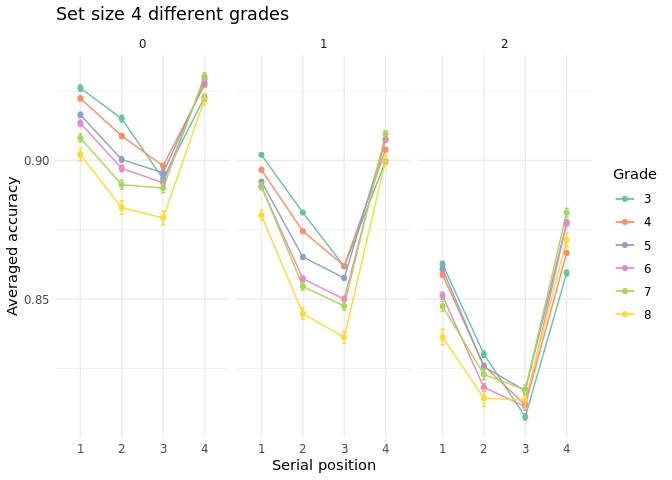<!-- -->

``` r
setsize4diffMedium <- logs_half_plt %>%
  filter(set_size == 4, difficulty == 1 ) %>% 
  ggplot(aes(x = position, y = mean, group = factor(grade), color = factor(grade))) +
  geom_line() +
  geom_point() +
  geom_errorbar(aes(ymin = mean - sd / sqrt(n), ymax = mean + sd / sqrt(n)), width = 0.1) + #SE 
  labs(
    title = "Number Game: Set size 4 and Medium Diff 
    for different grades",
    x = "Serial position",
    y = "Averaged accuracy",
    color = "Grade") +
  scale_x_discrete(labels = c("position_1" = "1", "position_2" = "2", "position_3" = "3", "position_4" = "4"))+
  scale_color_brewer(palette = "Set2") +
  theme_minimal()
setsize4diffMedium
```

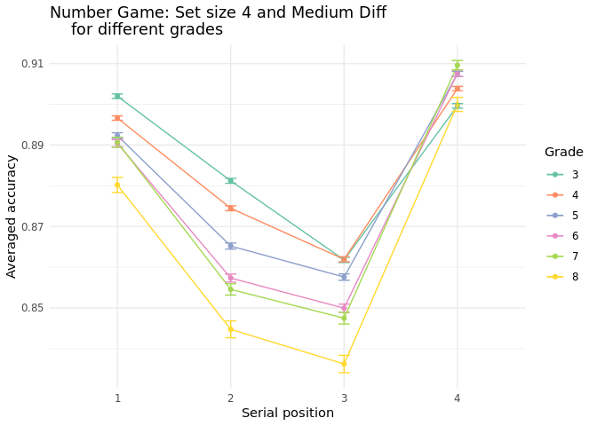<!-- -->

``` r
setsize8 <- logs_half_plt %>%
  filter(set_size == 8 ) %>% 
  ggplot(aes(x = position, y = mean, group = factor(grade), color = factor(grade))) +
  geom_line() +
  geom_point() +
  geom_errorbar(aes(ymin = mean - sd / sqrt(n), ymax = mean + sd / sqrt(n)), width = 0.1) + #SE 
  facet_wrap(~ difficulty) +
  labs(
    title = "Set size 8 and diff Medium 
    for different grades",
    x = "Serial position",
    y = "Averaged accuracy",
    color = "Grade") +
  scale_x_discrete(labels = c("position_1" = "1", "position_2" = "2", "position_3" = "3", "position_4" = "4",
                              "position_5" = "5", "position_6" = "6", "position_7" = "7", "position_8" = "8"))+
  scale_color_brewer(palette = "Set2") +
  theme_minimal()
setsize8
```

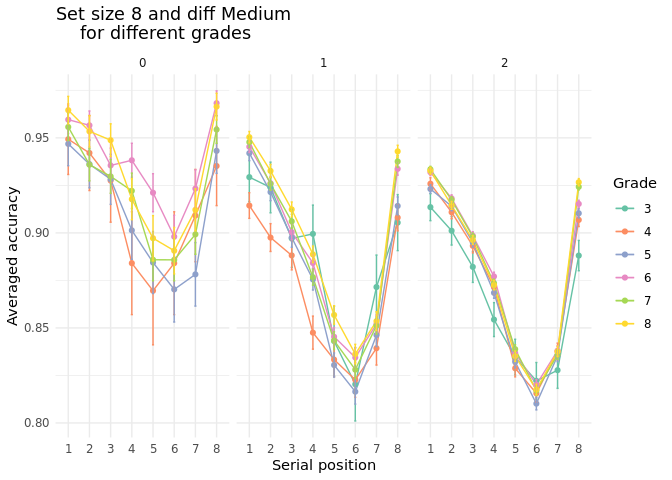<!-- -->

``` r
setsize8diffHard <- logs_half_plt %>%
  filter(set_size == 8, difficulty == 2 ) %>% 
  ggplot(aes(x = position, y = mean, group = factor(grade), color = factor(grade))) +
  
  # first plot the accuracy per serial position as lines and points
  geom_line() +
  geom_point() +
  geom_errorbar(aes(ymin = mean - sd / sqrt(n), ymax = mean + sd / sqrt(n)), width = 0.1) + #SE 
  #facet_wrap(~ difficulty) +
  labs(
    title = "NumberGame: Set size 8 and diff Hard 
    for different grades",
    x = "Serial position",
    y = "Averaged accuracy",
    color = "Grade") +
  scale_x_discrete(labels = c("position_1" = "1", "position_2" = "2", "position_3" = "3", "position_4" = "4",
                              "position_5" = "5", "position_6" = "6", "position_7" = "7", "position_8" = "8"))+
  scale_color_brewer(palette = "Set2") +
  theme_minimal()
setsize8diffHard
```

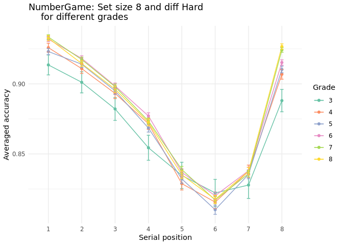<!-- -->

``` r
setsize10 <- logs_half_plt %>%
  filter(set_size == 10) %>% 
  ggplot(aes(x = position, y = mean, group = factor(grade), color = factor(grade))) +
  
  # first plot the accuracy per serial position as lines and points
  geom_line() +
  geom_point() +
  geom_errorbar(aes(ymin = mean - sd / sqrt(n), ymax = mean + sd / sqrt(n)), width = 0.1) + #SE 
  facet_wrap(~ difficulty) +
  labs(
    title = "Set size 10 for different grades",
    x = "Serial position",
    y = "Averaged accuracy",
    color = "Grade") +
  scale_x_discrete(labels = as.factor(c("position_1" = "1", "position_2" = "2", "position_3" = "3", "position_4" = "4", "position_5" = "5",
                              "position_6" = "6", "position_7" = "7", "position_8" = "8", "position_9" = "9", "position_10" = "10")))+
  scale_color_brewer(palette = "Set2") +
  theme_minimal()
setsize10
```

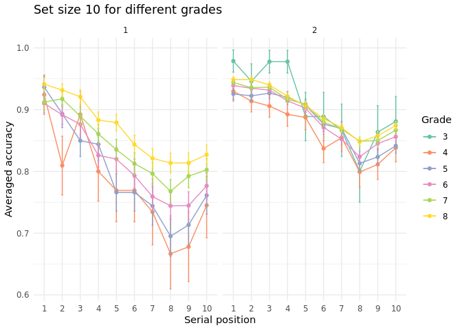<!-- -->

``` r
plot_small <- logs_half_plt %>%
  filter(grade == 4, difficulty == 2, set_size <= 8) %>%
  ggplot(aes(x = position, y = mean, group = factor(set_size), color = factor(set_size))) +
  geom_line() +
  geom_point() +
  geom_errorbar(aes(ymin = mean - sd / sqrt(n), ymax = mean + sd / sqrt(n)), width = 0.1) +
  labs(title = "Set Size ≤ 8", x = "Serial Position", y = "Average Accuracy", color = "Set Size") +
  scale_x_discrete(labels = as.factor(c("position_1" = "1", "position_2" = "2", "position_3" = "3", "position_4" = "4",
                                        "position_5" = "5", "position_6" = "6", "position_7" = "7", "position_8" = "8", "position_9" = "9",
                                        "position_10" = "10", "position_11" = "11", "position_12" = "12", "position_13" = "13", "position_14" = "14", "position_15" = "15"))) +
  scale_color_brewer(palette = "Set2") +
  theme_minimal()

plot_large <- logs_half_plt %>%
  filter(grade == 4, difficulty == 2, set_size > 8) %>%
  ggplot(aes(x = position, y = mean, group = factor(set_size), color = factor(set_size))) +
  geom_line() +
  geom_point() +
  geom_errorbar(aes(ymin = mean - sd / sqrt(n), ymax = mean + sd / sqrt(n)), width = 0.1) +
  labs(title = "Set Size > 8", x = "Serial Position", y = "Average Accuracy", color = "Set Size") +
  scale_x_discrete(labels = as.factor(c("position_1" = "1", "position_2" = "2", "position_3" = "3", "position_4" = "4",
                                        "position_5" = "5", "position_6" = "6", "position_7" = "7", "position_8" = "8", "position_9" = "9",
                                        "position_10" = "10", "position_11" = "11", "position_12" = "12", "position_13" = "13", "position_14" = "14", "position_15" = "15"))) +
  scale_color_brewer(palette = "Set2") +
  theme_minimal()

plot_small / plot_large + plot_annotation(title = "Grade 4 Difficulty: Hard")
```

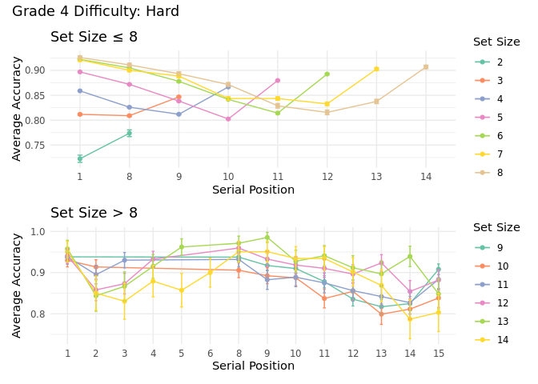<!-- -->

### Primacy and Recency Effect with un-grouped items (Repetition)

``` r
#set aside the half of the students and investigate. 
# Select unique students with grade info
students <- logs_number_rep %>%
  select(user_id, grade) %>%
  distinct()

set.seed(2012)
# Sample 50% of students within each grade
sampled_students <- students %>%
  group_by(grade) %>%
  sample_frac(0.5) %>%
  ungroup()

logs_number_rep_half <- logs_number_rep %>%
  filter(user_id %in% sampled_students$user_id)

#Select unrepeated and unduplicated items
logs_number_rep_half_unrepeated_undupl <- logs_number_rep_half %>% 
  filter(repetition == 0 & duplicate == 0)

#Select repeated and duplicated items
logs_number_half_rep_dupl <- logs_number_rep_half %>% 
  filter(repetition != 0 & duplicate != 0)
```

``` r
logs_half_unrepeated_undupl <- logs_number_rep_half_unrepeated_undupl %>%
  group_by(difficulty, set_size, grade) %>%
  filter(n() > 50) %>%
  group_by(difficulty, set_size, grade) %>%
  summarise(
    across(starts_with("position_"), list(mean = ~mean(.x, na.rm = TRUE),
                                          sd = ~sd(.x, na.rm = TRUE))),
    n = n(), 
    .groups = "drop"
  ) %>%
  pivot_longer(
    cols = -c(difficulty, set_size, grade, n),
    names_to = c("position", ".value"),
    names_pattern = "(.+?)_(mean|sd)$",
    values_drop_na = TRUE
  )

logs_number_half_rep_dupl <- logs_number_half_rep_dupl %>%
  group_by(difficulty, set_size, grade) %>%
  filter(n() > 50) %>%
  group_by(difficulty, set_size, grade) %>%
  summarise(
    across(starts_with("position_"), list(mean = ~mean(.x, na.rm = TRUE),
                                          sd = ~sd(.x, na.rm = TRUE))),
    n = n(), 
    .groups = "drop"
  ) %>%
  pivot_longer(
    cols = -c(difficulty, set_size, grade, n),
    names_to = c("position", ".value"),
    names_pattern = "(.+?)_(mean|sd)$",
    values_drop_na = TRUE
  )
```

``` r
setsize4_dif1_unrep <- logs_half_unrepeated_undupl %>%
  filter(set_size == 4 & difficulty == 1) %>% 
  ggplot(aes(x = position, y = mean, group = factor(grade), color = factor(grade))) +
  
  # first plot the accuracy per serial position as lines and points
  geom_line() +
  geom_point() +
  geom_errorbar(aes(ymin = mean - sd / sqrt(n), ymax = mean + sd / sqrt(n)), width = 0.1) + #SE 
  #facet_wrap(~ difficulty) +
  labs(
    title = "Set size 4 Unrepeated",
    x = "Serial position",
    y = "Averaged accuracy",
    color = "Grade") +
  scale_x_discrete(labels = c("position_1" = "1", "position_2" = "2", "position_3" = "3", "position_4" = "4"))+
  scale_color_brewer(palette = "Set2") +
  theme_minimal() +
  ylim(0.80, 0.95)
setsize4_dif1_unrep
```

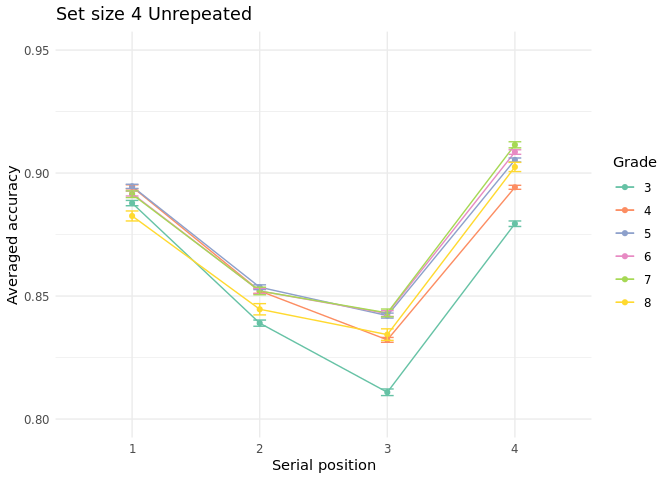<!-- -->

``` r
setsize4_dif1_rep <- logs_number_half_rep_dupl %>%
  filter(set_size == 4 & difficulty == 1) %>% 
  ggplot(aes(x = position, y = mean, group = factor(grade), color = factor(grade))) +
  
  # first plot the accuracy per serial position as lines and points
  geom_line() +
  geom_point() +
  geom_errorbar(aes(ymin = mean - sd / sqrt(n), ymax = mean + sd / sqrt(n)), width = 0.1) + #SE 
  #facet_wrap(~ difficulty) +
  labs(
    title = "Set size 4 Repeated",
    x = "Serial position",
    y = "Averaged accuracy",
    color = "Grade") +
  scale_x_discrete(labels = c("position_1" = "1", "position_2" = "2", "position_3" = "3", "position_4" = "4"))+
  scale_color_brewer(palette = "Set2") +
  theme_minimal() +
  ylim(0.80, 0.95)
setsize4_dif1_rep
```

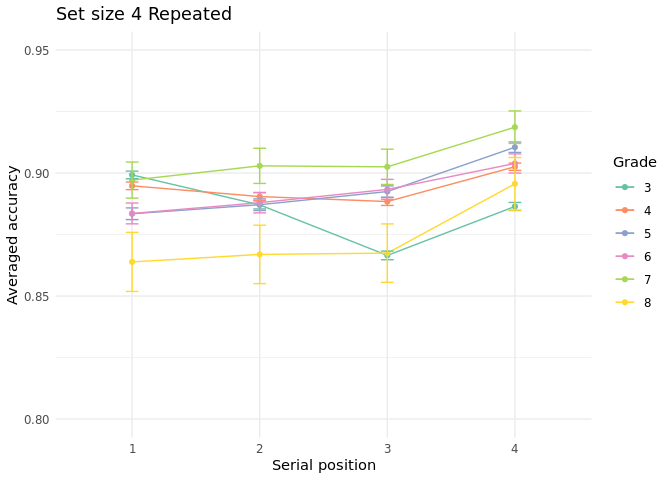<!-- -->

``` r
library(patchwork)

setsize4_repVsUnrep <- (setsize4_dif1_unrep + setsize4_dif1_rep) +
  plot_layout(guides = "collect") +
  plot_annotation(title = "Set Size 4: Accuracy by Serial Position - Medium Difficulty")
setsize4_repVsUnrep
```

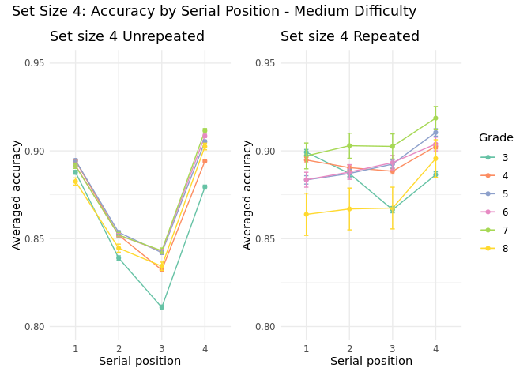<!-- -->

``` r
setsize5_unrepeated <- logs_half_unrepeated_undupl %>%
  filter(set_size == 5) %>% 
  ggplot(aes(x = position, y = mean, group = factor(grade), color = factor(grade))) +
  geom_line() +
  geom_point() +
  geom_errorbar(aes(ymin = mean - sd / sqrt(n), ymax = mean + sd / sqrt(n)), width = 0.1) + #SE 
  facet_wrap(~ difficulty) +
  labs(
    title = "Set size 5 for different grades - unrepeated",
    x = "Serial position",
    y = "Averaged accuracy",
    color = "Grade") +
  scale_x_discrete(labels = c("position_1" = "1", "position_2" = "2", "position_3" = "3", "position_4" = "4", "position_5" = "5"))+
  scale_color_brewer(palette = "Set2") +
  theme_minimal() +
  ylim(0.65, 1)

setsize5_repeated <- logs_number_half_rep_dupl %>%
  filter(set_size == 5) %>% 
  ggplot(aes(x = position, y = mean, group = factor(grade), color = factor(grade))) +
  
  # first plot the accuracy per serial position as lines and points
  geom_line() +
  geom_point() +
  geom_errorbar(aes(ymin = mean - sd / sqrt(n), ymax = mean + sd / sqrt(n)), width = 0.1) + #SE 
  facet_wrap(~ difficulty) +
  labs(
    title = "Set size 5 for different grades - repeated",
    x = "Serial position",
    y = "Averaged accuracy",
    color = "Grade") +
  scale_x_discrete(labels = c("position_1" = "1", "position_2" = "2", "position_3" = "3", "position_4" = "4", "position_5" = "5"))+
  scale_color_brewer(palette = "Set2") +
  theme_minimal() + 
  ylim(0.65, 1)


setsize5_repVsUnrep <- (setsize5_unrepeated / setsize5_repeated) +
  plot_layout(guides = "collect") +
  plot_annotation(title = "Set Size 5: Accuracy by Serial Position")
setsize5_repVsUnrep
```

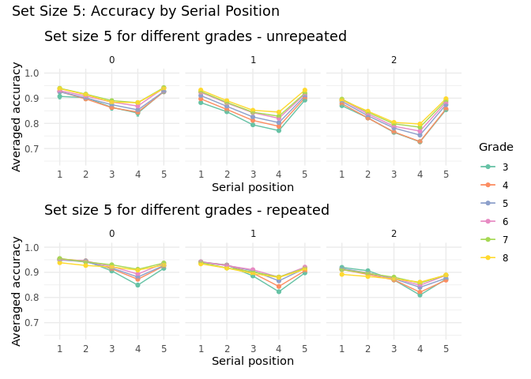<!-- -->

``` r
grade5_diff2_unrepeated <-  logs_half_unrepeated_undupl %>%
  filter(grade == 5 & difficulty == 2) %>% 
  ggplot(aes(x = position, y = mean, group = factor(set_size), color = factor(set_size))) +
  
  # first plot the accuracy per serial position as lines and points
  geom_line() +
  geom_point() +
  geom_errorbar(aes(ymin = mean - sd / sqrt(n), ymax = mean + sd / sqrt(n)), width = 0.1) + #SE 
  facet_wrap(~ difficulty) +
  labs(
    title = "Grade - Unrepeated",
    x = "Serial position",
    y = "Averaged accuracy",
    color = "Set Size") +
  scale_x_discrete(labels = c("position_1" = "1", "position_2" = "2", "position_3" = "3", "position_4" = "4",
                              "position_5" = "5", "position_6" = "6", "position_7" = "7", "position_8" = "8", "position_9" = "9"))+
  scale_color_brewer(palette = "Set2") +
  theme_minimal() +
  ylim(0.70, 1)

grade5_diff2_repeated <- logs_number_half_rep_dupl %>%
  filter(grade == 5 & difficulty == 2) %>%
  mutate(
    position = factor(position, levels = paste0("position_", 1:15)),
    set_size = factor(set_size, levels = sort(unique(set_size)))
  ) %>%
  ggplot(aes(x = position, y = mean, group = set_size, 
             color = set_size)) +  # color already factor above
  geom_line() +
  geom_point() +
  geom_errorbar(aes(ymin = mean - sd / sqrt(n), ymax = mean + sd / sqrt(n)), width = 0.1) +
  facet_wrap(~ difficulty) +
  labs(
    title = "Grade 4 - repeated",
    x = "Serial Position",
    y = "Average Accuracy",
    color = "Set Size"
  ) +
  scale_x_discrete(labels = setNames(as.character(1:15), paste0("position_", 1:15))) +
  scale_color_viridis_d(option = "D", begin = 0.1, end = 0.9) +
  theme_minimal() +
  ylim(0.70, 1)

grade5_diff2_repVsUnrep <- (grade5_diff2_unrepeated + grade5_diff2_repeated) +
  plot_annotation(title = "Grade 5: Accuracy by Serial Position - Hard Diff")
grade5_diff2_repVsUnrep
```

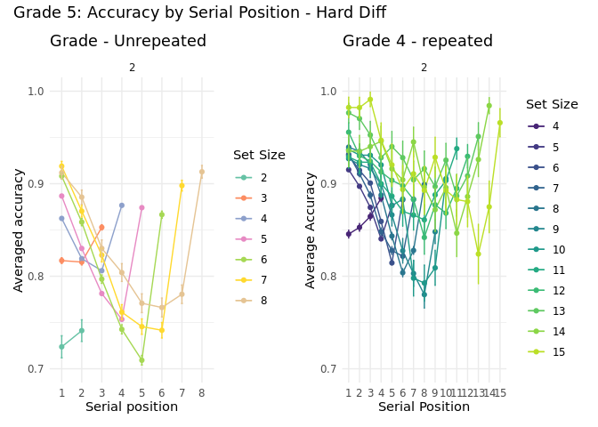<!-- -->

## Mole Game

``` r
setsize4_dif1 <- logs_half_plt %>%
  filter(set_size == 4 & difficulty == 1) %>% 
  ggplot(aes(x = position, y = mean, group = factor(grade), color = factor(grade))) +
  
  # first plot the accuracy per serial position as lines and points
  geom_line() +
  geom_point() +
  geom_errorbar(aes(ymin = mean - sd / sqrt(n), ymax = mean + sd / sqrt(n)), width = 0.1) + #SE 
  #facet_wrap(~ difficulty) +
  labs(
    title = "Set size 4 All Items",
    x = "Serial position",
    y = "Averaged accuracy",
    color = "Grade") +
  scale_x_discrete(labels = c("position_1" = "1", "position_2" = "2", "position_3" = "3", "position_4" = "4"))+
  scale_color_brewer(palette = "Set2") +
  theme_minimal() +
  ylim(0.75, 0.95)
setsize4_dif1
```

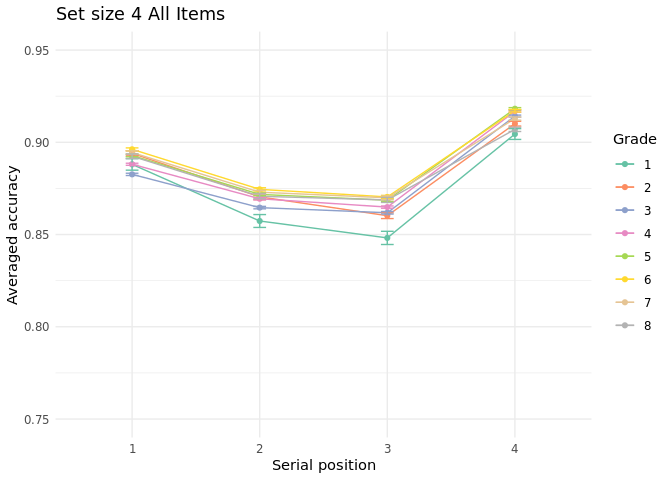<!-- -->

``` r
setsize5 <- logs_half_plt %>%
  filter(set_size == 5) %>% 
  ggplot(aes(x = position, y = mean, group = factor(grade), color = factor(grade))) +
  
  # first plot the accuracy per serial position as lines and points
  geom_line() +
  geom_point() +
  geom_errorbar(aes(ymin = mean - sd / sqrt(n), ymax = mean + sd / sqrt(n)), width = 0.1) + #SE 
  facet_wrap(~ difficulty) +
  labs(
    title = "Set size 5 for different grades",
    x = "Serial position",
    y = "Averaged accuracy",
    color = "Grade") +
  scale_x_discrete(labels = c("position_1" = "1", "position_2" = "2", "position_3" = "3", "position_4" = "4", "position_5" = "5"))+
  scale_color_brewer(palette = "Set2") +
  theme_minimal()
setsize5
```

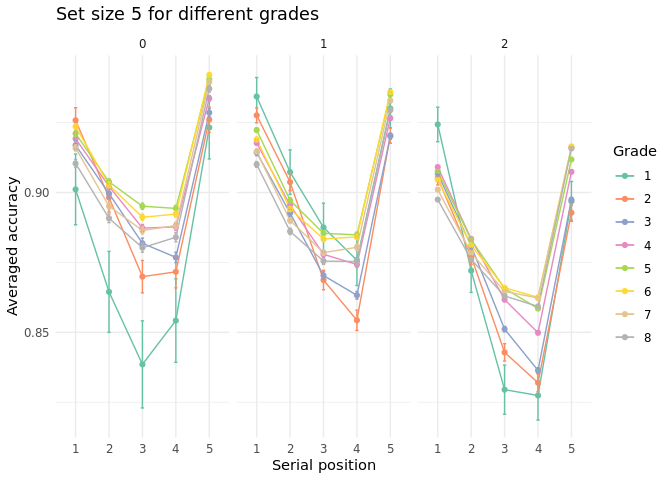<!-- -->

``` r
grade4 <-  logs_half_plt %>%
  filter(grade == 4) %>% 
  ggplot(aes(x = position, y = mean, group = factor(set_size), color = factor(set_size))) +
  
  # first plot the accuracy per serial position as lines and points
  geom_line() +
  geom_point() +
  geom_errorbar(aes(ymin = mean - sd / sqrt(n), ymax = mean + sd / sqrt(n)), width = 0.1) + #SE 
  facet_wrap(~ difficulty) +
  labs(
    title = "Grade 4 Primacy and Recency Effect",
    x = "Serial position",
    y = "Averaged accuracy",
    color = "Set Size") +
  scale_x_discrete(labels = c("position_1" = "1", "position_2" = "2", "position_3" = "3", "position_4" = "4",
                              "position_5" = "5", "position_6" = "6", "position_7" = "7", "position_8" = "8", "position_9" = "9"))+
  scale_color_brewer(palette = "Set2") +
  theme_minimal()
grade4
```

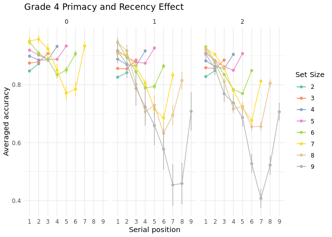<!-- -->

### Primacy and Recency effect - ungrouped items (structure)

``` r
setsize4_dif1_unstr <- logs_unstructured_prop_accuracy_half_plt %>%
  filter(set_size == 4 & difficulty == 1) %>% 
  ggplot(aes(x = position, y = mean, group = factor(grade), color = factor(grade))) +
  
  # first plot the accuracy per serial position as lines and points
  geom_line() +
  geom_point() +
  geom_errorbar(aes(ymin = mean - sd / sqrt(n), ymax = mean + sd / sqrt(n)), width = 0.1) + #SE 
  #facet_wrap(~ difficulty) +
  labs(
    title = "Set size 4 Unstructured",
    x = "Serial position",
    y = "Averaged accuracy",
    color = "Grade") +
  scale_x_discrete(labels = c("position_1" = "1", "position_2" = "2", "position_3" = "3", "position_4" = "4"))+
  scale_color_brewer(palette = "Set2") +
  theme_minimal() +
  ylim(0.75, 0.95)

setsize4_strVsUnstr <- (setsize4_dif1 + setsize4_dif1_unstr) +
  plot_layout(guides = "collect") +
  plot_annotation(title = "Set Size 4: Accuracy by Serial Position - Medium Difficulty")
setsize4_strVsUnstr
```

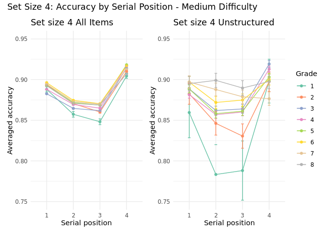<!-- -->

``` r
setsize5 <- logs_unstructured_prop_accuracy_half_plt %>%
  filter(set_size == 5) %>% 
  ggplot(aes(x = position, y = mean, group = factor(grade), color = factor(grade))) +
  
  # first plot the accuracy per serial position as lines and points
  geom_line() +
  geom_point() +
  geom_errorbar(aes(ymin = mean - sd / sqrt(n), ymax = mean + sd / sqrt(n)), width = 0.1) + #SE 
  facet_wrap(~ difficulty) +
  labs(
    title = "Set size 5 for different grades - Unstrc",
    x = "Serial position",
    y = "Averaged accuracy",
    color = "Grade") +
  scale_x_discrete(labels = c("position_1" = "1", "position_2" = "2", "position_3" = "3", "position_4" = "4", "position_5" = "5"))+
  scale_color_brewer(palette = "Set2") +
  theme_minimal()
setsize5
```

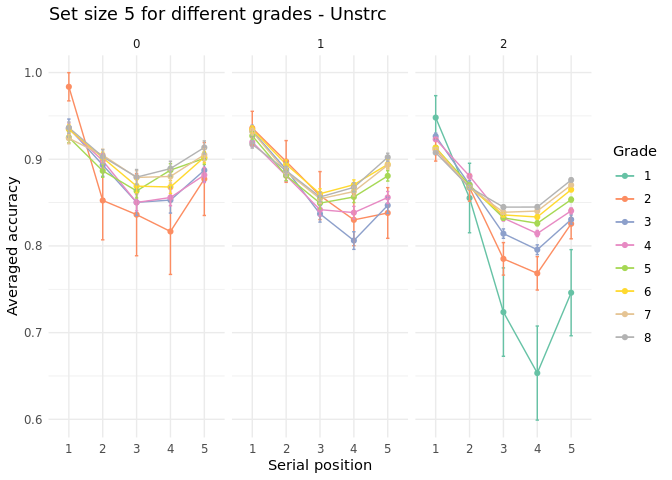<!-- -->

``` r
grade4 <-  logs_unstructured_prop_accuracy_half_plt %>%
  filter(grade == 4) %>% 
  ggplot(aes(x = position, y = mean, group = factor(set_size), color = factor(set_size))) +
  
  # first plot the accuracy per serial position as lines and points
  geom_line() +
  geom_point() +
  geom_errorbar(aes(ymin = mean - sd / sqrt(n), ymax = mean + sd / sqrt(n)), width = 0.1) + #SE 
  facet_wrap(~ difficulty) +
  labs(
    title = "Grade 4 Primacy and Recency Effect - Unstruct",
    x = "Serial position",
    y = "Averaged accuracy",
    color = "Set Size") +
  scale_x_discrete(labels = c("position_1" = "1", "position_2" = "2", "position_3" = "3", "position_4" = "4",
                              "position_5" = "5", "position_6" = "6", "position_7" = "7", "position_8" = "8", "position_9" = "9"))+
  scale_color_brewer(palette = "Set2") +
  theme_minimal()
grade4
```

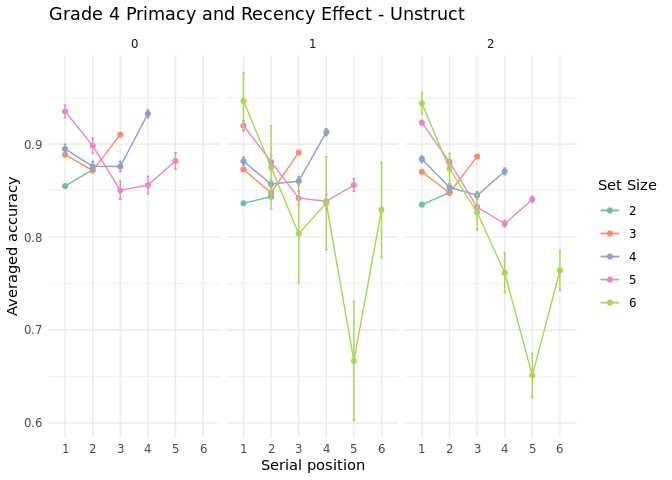<!-- -->

# Longitudinal Data

## Mole Game

How does primacy and recency changes for some students?

``` r
#Select students that played the game at grade 4 and then grade 7 at least 20 items 
logs_47 <- logs_half %>%
  filter(grade %in% c(4, 7))

user_counts <- logs_47 %>%
  group_by(user_id, grade) %>%
  summarise(n_items = n(), .groups = "drop")

users_20_each_grade <- user_counts %>%
  filter(n_items >= 20) %>%
  group_by(user_id) %>%
  filter(n() == 2) %>%  # both grade 4 and 7 must be present
  pull(user_id) %>%
  unique()

logs_grade7and4_min20 <- logs_47 %>%
  filter(user_id %in% users_20_each_grade)

length(unique(logs_grade7and4_min20$user_id))  #3945 students whithout items restrictions and with it's  1165
```

    ## [1] 1165

``` r
logs_grade7and4_plt <- logs_grade7and4_min20 %>%
  group_by(difficulty, set_size, grade) %>%
  group_by(difficulty, set_size, grade) %>%
  filter(n() > 50) %>% #at least 50 observation which makes the graph weird but necessary
  summarise(
    across(starts_with("position_"), list(mean = ~mean(.x, na.rm = TRUE),
                                          sd = ~sd(.x, na.rm = TRUE))),
    n = n(), 
    .groups = "drop"
  ) %>%
  pivot_longer(
    cols = -c(difficulty, set_size, grade, n),
    names_to = c("position", ".value"),
    names_pattern = "(.+?)_(mean|sd)$",
    values_drop_na = TRUE
  )
```

``` r
grade7and4_dif1_plt <- logs_grade7and4_plt %>%
  filter(difficulty == 1) %>% 
  ggplot(aes(x = position, y = mean, group = factor(grade), color = factor(grade))) +
  # first plot the accuracy per serial position as lines and points
  geom_line() +
  geom_point() +
  geom_errorbar(aes(ymin = mean - sd / sqrt(n), ymax = mean + sd / sqrt(n)), width = 0.1) + #SE 
  facet_wrap(~ set_size) +
  labs(
    title = "Students played in grades 4 and 7 at least 20 items
    - at least 50 observation in every diff-setsize-grade level -
    Medium Difficulty",
    x = "Serial position",
    y = "Averaged accuracy",
    color = "Grade") +
  scale_x_discrete(labels = c("position_1" = "1", "position_2" = "2", "position_3" = "3", "position_4" = "4", "position_5" = "5",
                              "position_6" = "6", "position_7" = "7", "position_8" = "8", "position_9" = "9"))+
  scale_color_brewer(palette = "Set2") +
  theme_minimal()

grade7and4_dif2_plt <- logs_grade7and4_plt %>%
  filter(difficulty == 2) %>% 
  ggplot(aes(x = position, y = mean, group = factor(grade), color = factor(grade))) +
  # first plot the accuracy per serial position as lines and points
  geom_line() +
  geom_point() +
  geom_errorbar(aes(ymin = mean - sd / sqrt(n), ymax = mean + sd / sqrt(n)), width = 0.1) + #SE 
  facet_wrap(~ set_size) +
  labs(
    title = "Students played in grades 4 and 7 at least 20 times
    -  at least 50 observation in total-
    Hard Difficulty",
    x = "Serial position",
    y = "Averaged accuracy",
    color = "Grade") +
  scale_x_discrete(labels = c("position_1" = "1", "position_2" = "2", "position_3" = "3", "position_4" = "4", "position_5" = "5",
                              "position_6" = "6", "position_7" = "7", "position_8" = "8", "position_9" = "9"))+
  scale_color_brewer(palette = "Set2") +
  theme_minimal()
grade7and4_dif1_plt
```

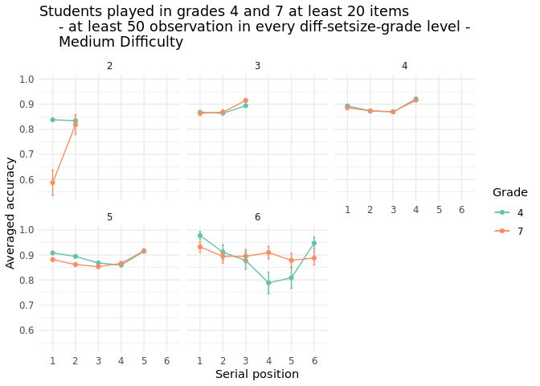<!-- -->

``` r
grade7and4_dif2_plt
```

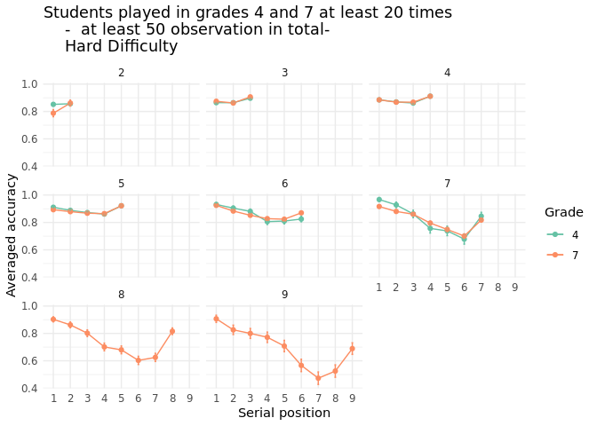<!-- -->

### Ungrouped

``` r
##unstructured 

#Select students that played the game at grade 4 and then grade 7 at least 20 items 
logs_47_unstructured <- logs_unstructured_prop_accuracy_half %>%
  filter(grade %in% c(4, 7))

user_counts <- logs_47_unstructured %>%
  group_by(user_id, grade) %>%
  summarise(n_items = n(), .groups = "drop")

users_10_each_grade <- user_counts %>%
  filter(n_items >= 10) %>%
  group_by(user_id) %>%
  filter(n() == 2) %>%  # both grade 4 and 7 must be present
  pull(user_id) %>%
  unique()

logs_grade7and4_min10_unstructured <- logs_47_unstructured %>%
  filter(user_id %in% users_10_each_grade)

length(unique(logs_grade7and4_min10_unstructured$user_id))  #50 students without items restrictions and with it's  1165
```

    ## [1] 50

``` r
logs_grade7and4_min10_unstructured_plt <- logs_grade7and4_min10_unstructured %>%
  group_by(difficulty, set_size, grade) %>%
  group_by(difficulty, set_size, grade) %>%
  filter(n() > 50) %>% #at least 50 observation which makes the graph weird but necessary
  summarise(
    across(starts_with("position_"), list(mean = ~mean(.x, na.rm = TRUE),
                                          sd = ~sd(.x, na.rm = TRUE))),
    n = n(), 
    .groups = "drop"
  ) %>%
  pivot_longer(
    cols = -c(difficulty, set_size, grade, n),
    names_to = c("position", ".value"),
    names_pattern = "(.+?)_(mean|sd)$",
    values_drop_na = TRUE
  )
```

``` r
grade7and4_dif1_plt <- logs_grade7and4_min10_unstructured_plt %>%
  filter(difficulty == 1) %>% 
  ggplot(aes(x = position, y = mean, group = factor(grade), color = factor(grade))) +
  # first plot the accuracy per serial position as lines and points
  geom_line() +
  geom_point() +
  geom_errorbar(aes(ymin = mean - sd / sqrt(n), ymax = mean + sd / sqrt(n)), width = 0.1) + #SE 
  facet_wrap(~ set_size) +
  labs(
    title = "Students played in grades 4 and 7 at least 10 items
    - at least 50 observation in every diff-setsize-grade level -
    Medium Difficulty- Unstr",
    x = "Serial position",
    y = "Averaged accuracy",
    color = "Grade") +
  scale_x_discrete(labels = c("position_1" = "1", "position_2" = "2", "position_3" = "3", "position_4" = "4", "position_5" = "5",
                              "position_6" = "6", "position_7" = "7", "position_8" = "8", "position_9" = "9"))+
  scale_color_brewer(palette = "Set2") +
  theme_minimal()
grade7and4_dif1_plt
```

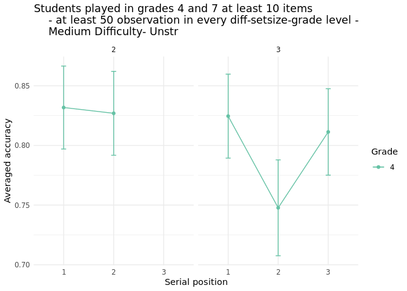<!-- -->

``` r
grade7and4_dif2_plt <- logs_grade7and4_min10_unstructured_plt %>%
  filter(difficulty == 2) %>% 
  ggplot(aes(x = position, y = mean, group = factor(grade), color = factor(grade))) +
  # first plot the accuracy per serial position as lines and points
  geom_line() +
  geom_point() +
  geom_errorbar(aes(ymin = mean - sd / sqrt(n), ymax = mean + sd / sqrt(n)), width = 0.1) + #SE 
  facet_wrap(~ set_size) +
  labs(
    title = "Students played in grades 4 and 7 at least 10 times
    -  at least 50 observation in total-
    Hard Difficulty - Unstructured",
    x = "Serial position",
    y = "Averaged accuracy",
    color = "Grade") +
  scale_x_discrete(labels = c("position_1" = "1", "position_2" = "2", "position_3" = "3", "position_4" = "4", "position_5" = "5",
                              "position_6" = "6", "position_7" = "7", "position_8" = "8", "position_9" = "9"))+
  scale_color_brewer(palette = "Set2") +
  theme_minimal()
grade7and4_dif2_plt
```

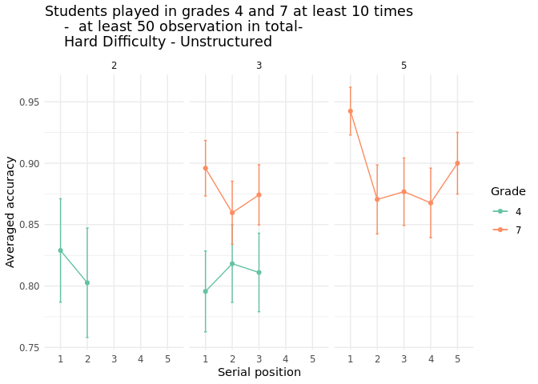<!-- -->
