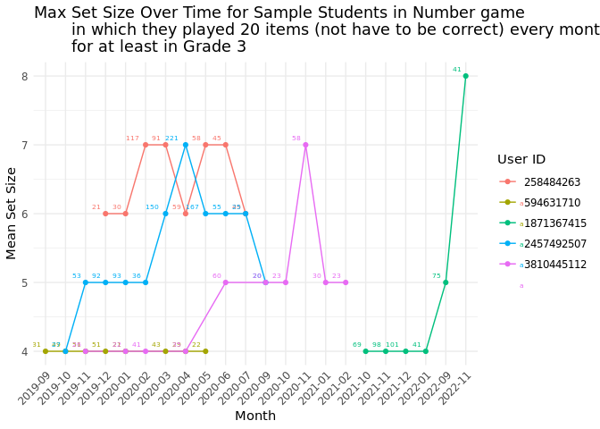
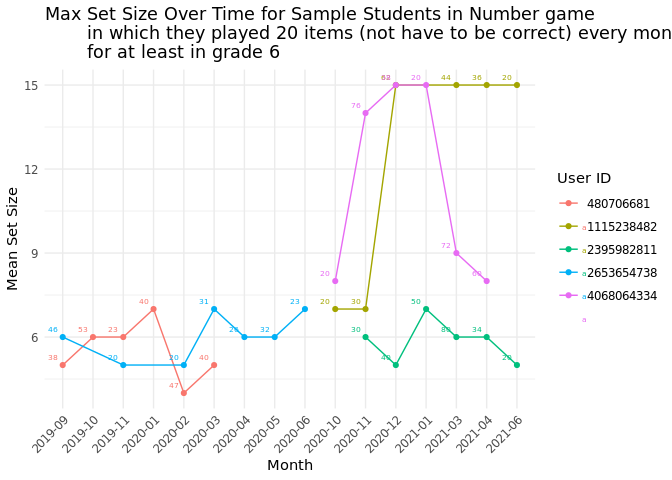
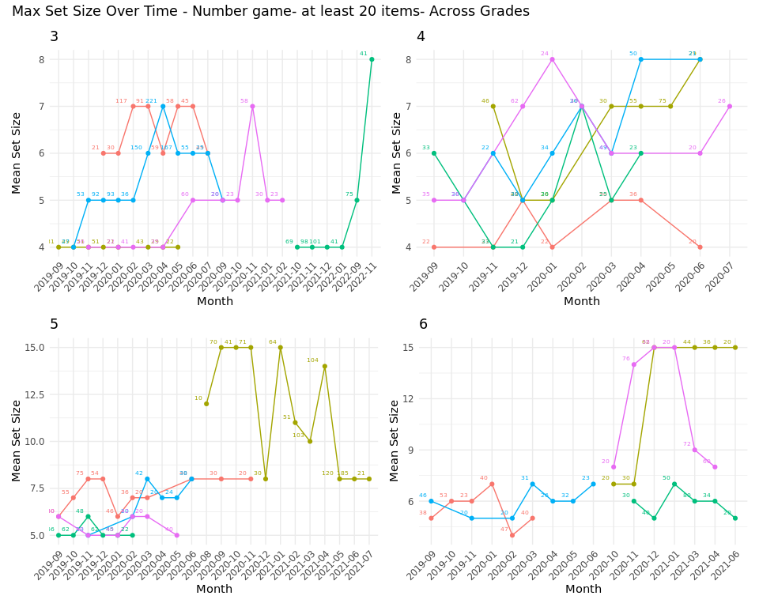
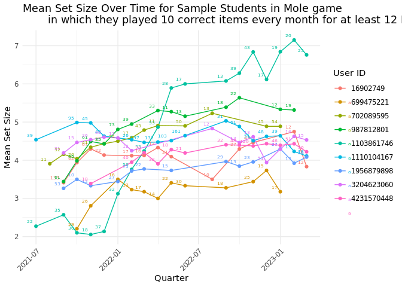
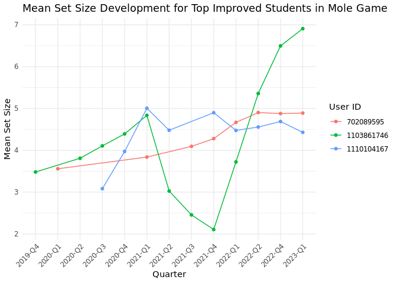
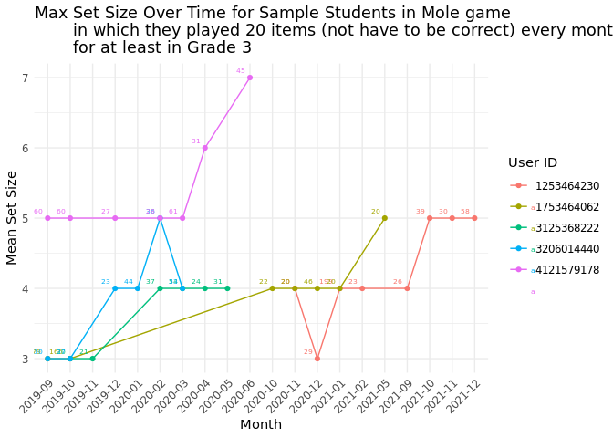
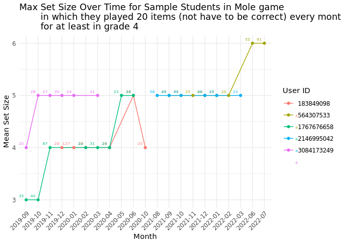
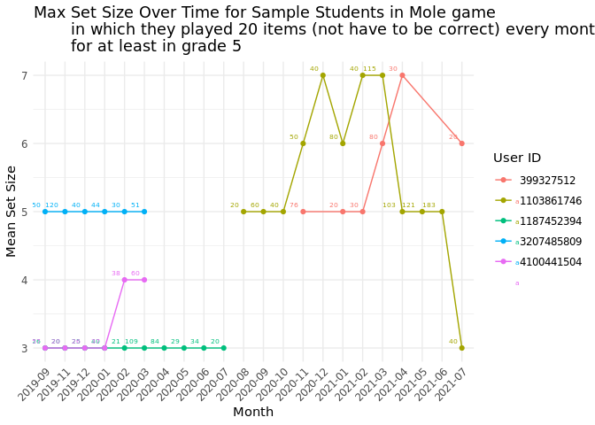
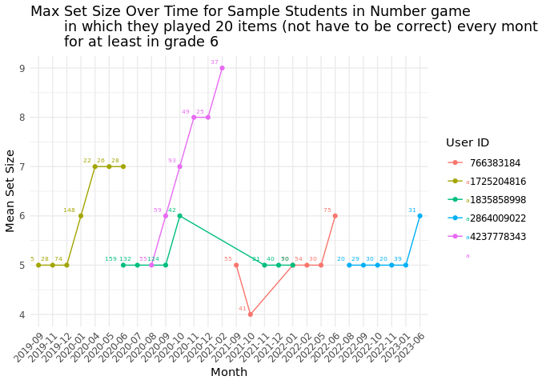
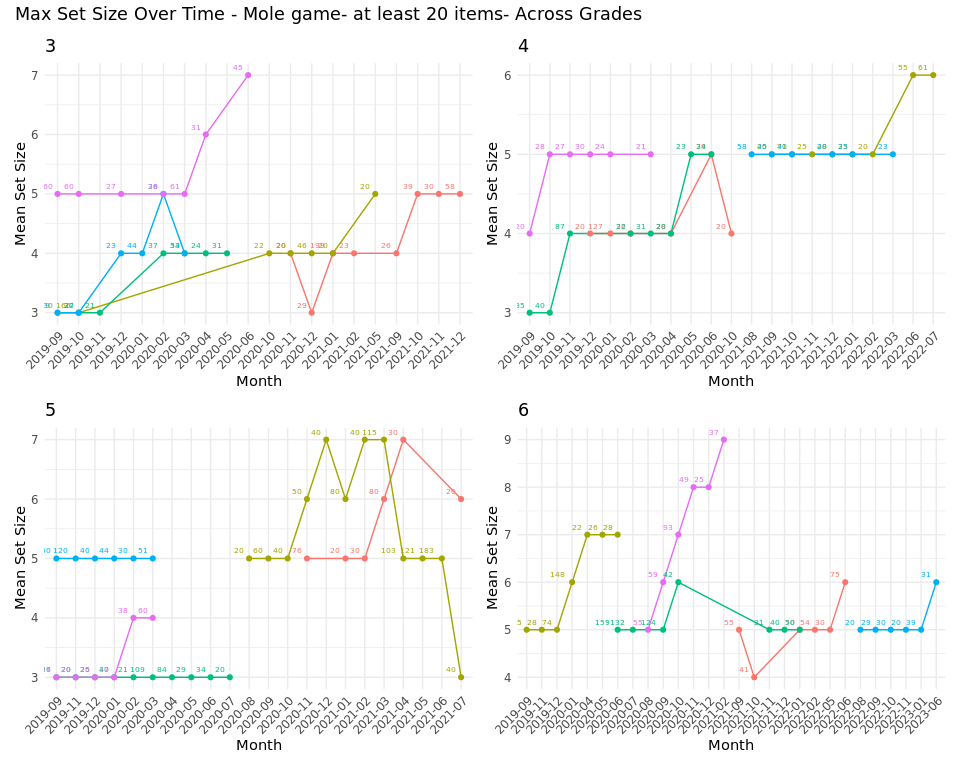

WM_TimeSeries_CapacityDevelopment_v0
================

# Number Game

We tried a few student selection options.

## Selection 1

Select students: - record in quarters in which they played more than 4
sessions - select the *correct answers* - that have at least 8 quarters
for 4 years (half of it)

``` r
correct_set_size_development <- logs_quarter %>% 
  group_by(user_id, quarter) %>% #calculate max and mean set size for the quarters for students
  summarise(mean_set_size = mean(set_size, na.rm = TRUE), 
            median_set_size = median(set_size, na.rm = TRUE),
            max_set_size = max(set_size, na.rm = TRUE),
            min_set_size = min(set_size, na.rm = TRUE),
            plays = n()) %>%
  ungroup()  
```

    ## `summarise()` has grouped output by 'user_id'. You can override using the
    ## `.groups` argument.

``` r
length(unique(correct_set_size_development$user_id))
```

    ## [1] 5

``` r
# Plot trends for the sample of students
ggplot(correct_set_size_development, aes(x = quarter, y = mean_set_size, group = user_id, color = as.factor(user_id))) +
  geom_line() +
  geom_point() +
  geom_text(aes(label = plays), vjust = -1, hjust = 1.5, size=2) +  # play counts
  labs(title = "Mean Set Size Over Time for Sample Students in Number game 
       in which they played 40 correct items every Q for at least 8 Q",
       x = "Quarter",
       y = "Mean Set Size",
       color = "User ID") +
  theme_minimal() +
  theme(axis.text.x = element_text(angle = 45, hjust = 1))
```

<!-- -->

``` r
ggplot(correct_set_size_development, aes(x = quarter, y = max_set_size, group = user_id, color = as.factor(user_id))) +
  geom_line() +
  geom_point() +
  geom_text(aes(label = plays), vjust = -1, hjust = 1.5, size=2) + 
  labs(title = "Max Set Size Over Time for Sample Students in Number game 
       in which they played 40 correct items every Q for at least 8 Q",
       x = "Quarter",
       y = "Mean Set Size",
       color = "User ID") +
  theme_minimal() +
  theme(axis.text.x = element_text(angle = 45, hjust = 1))
```

<!-- -->

## Selection 2

Select students: - **filter 2021-Q3 and 2023-Q2 (2 years) to filter out
the Covid effect** - record in quarters in which they played more than 4
sessions - select the *correct answers* - that have at least 6 quarters
for 2

``` r
length(unique(correct_set_size_development_2years$user_id)) 
```

    ## [1] 1

## Selection 3

Select students: - filter 2021-Q3 and 2023-Q2 (2 years) - look at
**monthly** at least 1 session - select the correct answers - that have
at least 12 month for 2 years

``` r
#Selection3#

#To exclude the covid effect and narrow down the time window
# filter 2021-Q3 and 2023-Q2 (2 years)
#look at monthly

## Select students record in months in which played more than 1 session 
logs_quarter_2years_mon <- merged_logs %>%
  mutate(month = floor_date(created_date, "month")) %>%
  filter(quarter %in% c("2021-Q3", "2021-Q4", "2022-Q1", "2022-Q2", "2022-Q3", "2022-Q4", "2023-Q1", "202-Q2")) %>% #right times
  filter(correct_answered == "1") %>%  #select the correct answers 
  group_by(user_id, month) %>%
  filter(n() >= 10) 

## Select students that have at least 12 month for 2 years (half of it)
students_with_12_mon_2years <- logs_quarter_2years_mon %>% 
  group_by(user_id) %>%
  summarise(unique_month = n_distinct(month)) %>%
  filter(unique_month >= 12) %>%
  select(user_id)


## Merge logs and students so that this data includes records of students that played at least 4 sessions in at least 8 quarters
logs_quarter_2years_mon <- logs_quarter_2years_mon %>% 
  filter(user_id %in% students_with_12_mon_2years$user_id) 


correct_set_size_development_2years_mon <- logs_quarter_2years_mon %>% 
  group_by(user_id, month) %>% #calculate max and mean set size for the quarters for students
  summarise(mean_set_size = mean(set_size, na.rm = TRUE), 
            median_set_size = median(set_size, na.rm = TRUE),
            max_set_size = max(set_size, na.rm = TRUE),
            min_set_size = min(set_size, na.rm = TRUE),
            plays = n()) %>%
  ungroup()
```

    ## `summarise()` has grouped output by 'user_id'. You can override using the
    ## `.groups` argument.

``` r
length(unique(correct_set_size_development_2years_mon$user_id)) #4 ? WOW
```

    ## [1] 4

``` r
# Plot trends for the sample of students
ggplot(correct_set_size_development_2years_mon, aes(x = month, y = mean_set_size, group = user_id, color = as.factor(user_id))) +
  geom_line() +
  geom_point() +
  geom_text(aes(label = plays), vjust = -1, hjust = 1.5, size=2) +  # Add play counts as labels
  labs(title = "Mean Set Size Over Time for Sample Students in Number game 
       in which they played 10 correct items every month for at least 12 months in 2021-23",
       x = "Month",
       y = "Mean Set Size",
       color = "User ID") +
  theme_minimal() +
  theme(axis.text.x = element_text(angle = 45, hjust = 1))
```

<!-- -->

``` r
ggplot(correct_set_size_development_2years_mon, aes(x = month, y = max_set_size, group = user_id, color = as.factor(user_id))) +
  geom_line() +
  geom_point() +
  geom_text(aes(label = plays), vjust = -1, hjust = 1.5, size=2) +  # Add play counts as labels
  labs(title = "Max Set Size Over Time for Sample Students in Number game 
       in which they played 10 correct items every month for at least 12 months in 2021-23",
       x = "Month",
       y = "Mean Set Size",
       color = "User ID") +
  theme_minimal() +
  theme(axis.text.x = element_text(angle = 45, hjust = 1))
```

<!-- -->

## Best Students

We select the students who improve the most among the students who : -
record in quarters in which they played more than 4 sessions - select
the *correct answers* - that have at least 8 quarters for 4 years (half
of it)

``` r
## Best Students - Number ######
# Calculate improvement for each student
student_improvement <- correct_set_size_development %>%
  group_by(user_id) %>%
  summarise(
    initial_set_size = first(mean_set_size),
    final_set_size = last(mean_set_size),
    improvement = final_set_size - initial_set_size
  ) %>%
  arrange(desc(improvement)) # Sort by improvement

# Select top 10 students with the most improvement
top_students <- student_improvement %>%
  top_n(10, improvement) %>%
  pull(user_id)

# Filter the data to include only the top 10 most improved students
top_student_data <- correct_set_size_development %>%
  filter(user_id %in% top_students)
```

``` r
# Plot mean set size changes over time for the most improved students
ggplot(top_student_data, aes(x = quarter, y = mean_set_size, group = user_id, color = as.factor(user_id))) +
  geom_line() +
  geom_point() +
  labs(title = "Mean Set Size Development for Top Improved Students",
       x = "Quarter",
       y = "Mean Set Size",
       color = "User ID") +
  theme_minimal() +
  theme(axis.text.x = element_text(angle = 45, hjust = 1))
```

<!-- -->

## Selection - Most students

``` r
students_month6_450days <- filter_users_by_plays_and_months(data=merged_logs_number, min_plays = 20 , min_months = 6, min_duration = 450)
nrow(students_month6_450days)
```

    ## [1] 970

We have 970 students that played the Number game at least 6 months with
2 sessions for min duration of 450 days.Let’s look at the grade levels.

``` r
merged_logs_number_tmp <- merged_logs_number %>% 
  filter(user_id %in% students_month6_450days$user_id) %>% 
  group_by(user_id, year_month) %>%
  filter(n() >= 20) %>% # Ensure at least 20 plays in each month we utilize
  ungroup()

table(merged_logs_number_tmp$grade)
```

    ## 
    ##      3      4      5      6      7      8 
    ##  99312 110239  49617  28592  11593   5185

### Grade 3

``` r
merged_logs_number_grade3 <- merged_logs_number_tmp %>% 
  filter(grade == 3) 
length(unique(merged_logs_number_grade3$user_id))
```

    ## [1] 423

We have 423 students from grade 3.

``` r
grade3 <- ggplot(correct_set_size_development_grade3, aes(x = year_month, y = max_set_size, group = user_id, color = as.factor(user_id))) +
  geom_line() +
  geom_point() +
  geom_text(aes(label = plays), vjust = -1, hjust = 1.5, size=2) +  # Add play counts as labels
  labs(title = "Max Set Size Over Time for Sample Students in Number game 
       in which they played 20 items (not have to be correct) every month 
       for at least in Grade 3",
       x = "Month",
       y = "Mean Set Size",
       color = "User ID") +
  theme_minimal() +
  theme(axis.text.x = element_text(angle = 45, hjust = 1))
grade3
```

<!-- -->

### Grade 4

``` r
merged_logs_number_grade4 <- merged_logs_number_tmp %>% 
  filter(grade == 4) 
length(unique(merged_logs_number_grade4$user_id))
```

    ## [1] 626

We have 626 students from grade 4. But some of the data may be coming
from grade 3 so filter for at least 6 months and select random 10
students.

``` r
merged_logs_number_grade4 <- merged_logs_number_grade4 %>% 
  group_by(user_id) %>% 
  filter(n_distinct(year_month) >= 6) %>%
  ungroup()
length(unique(merged_logs_number_grade4$user_id))
```

    ## [1] 221

``` r
grade4 <- ggplot(correct_set_size_development_grade4, aes(x = year_month, y = max_set_size, group = user_id, color = as.factor(user_id))) +
  geom_line() +
  geom_point() +
  geom_text(aes(label = plays), vjust = -1, hjust = 1.5, size=2) +  # Add play counts as labels
  labs(title = "Max Set Size Over Time for Sample Students in Number game 
       in which they played 20 items (not have to be correct) every month 
       for at least in grade 4",
       x = "Month",
       y = "Mean Set Size",
       color = "User ID") +
  theme_minimal() +
  theme(axis.text.x = element_text(angle = 45, hjust = 1))
grade4
```

<!-- -->
\### Grade 5

``` r
merged_logs_number_grade5 <- merged_logs_number_tmp %>% 
  filter(grade == 5) 
length(unique(merged_logs_number_grade5$user_id))
```

    ## [1] 434

We have 434 students from grade 5. But some of the data may be coming
from grade 3 and 4 so filter for at least 6 months and select random 10
students.

``` r
merged_logs_number_grade5 <- merged_logs_number_grade5 %>% 
  group_by(user_id) %>% 
  filter(n_distinct(year_month) >= 6) %>%
  ungroup()
length(unique(merged_logs_number_grade5))
```

    ## [1] 20

``` r
grade5 <- ggplot(correct_set_size_development_grade5, aes(x = year_month, y = max_set_size, group = user_id, color = as.factor(user_id))) +
  geom_line() +
  geom_point() +
  geom_text(aes(label = plays), vjust = -1, hjust = 1.5, size=2) +  # Add play counts as labels
  labs(title = "Max Set Size Over Time for Sample Students in Number game 
       in which they played 20 items (not have to be correct) every month 
       for at least in grade 5",
       x = "Month",
       y = "Mean Set Size",
       color = "User ID") +
  theme_minimal() +
  theme(axis.text.x = element_text(angle = 45, hjust = 1))
grade5
```

<!-- -->
\### Grade 6

``` r
merged_logs_number_grade6 <- merged_logs_number_tmp %>% 
  filter(grade == 6) 
length(unique(merged_logs_number_grade5$user_id))
```

    ## [1] 72

We have 72 students from grade 6. But some of the data may be coming
from grade 3, 4 and 5 so filter for at least 6 months and select random
10 students.

``` r
merged_logs_number_grade6 <- merged_logs_number_grade6 %>% 
  group_by(user_id) %>% 
  filter(n_distinct(year_month) >= 6) %>%
  ungroup()

length(unique(merged_logs_number_grade6))
```

    ## [1] 20

``` r
grade6 <- ggplot(correct_set_size_development_grade6, aes(x = year_month, y = max_set_size, group = user_id, color = as.factor(user_id))) +
  geom_line() +
  geom_point() +
  geom_text(aes(label = plays), vjust = -1, hjust = 1.5, size=2) +  # Add play counts as labels
  labs(title = "Max Set Size Over Time for Sample Students in Number game 
       in which they played 20 items (not have to be correct) every month 
       for at least in grade 6",
       x = "Month",
       y = "Mean Set Size",
       color = "User ID") +
  theme_minimal() +
  theme(axis.text.x = element_text(angle = 45, hjust = 1))
grade6
```

<!-- -->

``` r
grade3_clean <- grade3 + ggtitle("3") + theme(legend.position = "none")
grade4_clean <- grade4 + ggtitle("4") + theme(legend.position = "none")
grade5_clean <- grade5 + ggtitle("5") + theme(legend.position = "none")
grade6_clean <- grade6 + ggtitle("6") + theme(legend.position = "none")

combined_plot <- (grade3_clean + grade4_clean) / (grade5_clean + grade6_clean) +
  plot_annotation(
    title = "Max Set Size Over Time - Number game- at least 20 items- Across Grades"
  )

combined_plot
```

<!-- -->

# Mole Game

``` r
rm(list = ls())
load("~/research-collaboration/data-ro/data-users-40-66-2023-10-31.Rdata")
load("~/research-collaboration/data-ro/data-logs_40-2023-10-31.Rdata")
load("~/code_seyma/WMBenchmark/data/items.Rdata")
```

## Selection 1

Select students: - in quarters in which played more than 4 sessions  
- select the *correct answers* - that have at least 8 quarters for 4
years (half of it)

``` r
length(unique(correct_set_size_development40$user_id))
```

    ## [1] 3

``` r
# Plot trends for the sample of students
ggplot(correct_set_size_development40, aes(x = quarter, y = mean_set_size, group = user_id, color = as.factor(user_id))) +
  geom_line() +
  geom_point() +
  labs(title = "Mean Set Size Over Time for Sample Students in Mole Game
       played at least 40 correct items at least 8 quarter",
       x = "Quarter",
       y = "Mean Set Size",
       color = "User ID") +
  theme_minimal() +
  theme(axis.text.x = element_text(angle = 45, hjust = 1))
```

<!-- -->

``` r
ggplot(correct_set_size_development40, aes(x = quarter, y = max_set_size, group = user_id, color = as.factor(user_id))) +
  geom_line() +
  geom_point() +
  geom_text(aes(label = plays), vjust = -1, hjust = 1.5, size=2) +  # Add play counts as labels
  labs(title = "Max Set Size Over Time for Sample Students in Mole Game
       played at least 40 correct items at least 8 quarter",
       x = "Quarter",
       y = "Mean Set Size",
       color = "User ID") +
  theme_minimal() +
  theme(axis.text.x = element_text(angle = 45, hjust = 1))
```

<!-- -->

``` r
#Check the ability rating vs set sizes how they change 
correct_set_size_development40 %>% 
  filter(user_id == "1103861746") %>% 
  mutate(max_user_rating = max_rating/10) %>% 
  mutate(mean_item_rating = mean_item_rating/10) %>% 
  pivot_longer(
    cols = c(max_set_size, max_user_rating, mean_item_rating),
    names_to = "type",
    values_to = "score"
  ) %>%
  select(user_id,quarter, type, score) %>%
  ggplot(aes(x = quarter, y = score, color = type)) +
  geom_line() +
  geom_point() +
  labs(title = "Max Rating Over Time for Sample Students in Mole Game
       played at least 40 correct items at least 8 quarter",
       x = "Quarter",
       y = "Type",
       color = "User ID") +
  theme_minimal() +
  theme(axis.text.x = element_text(angle = 45, hjust = 1))
```

    ## `geom_line()`: Each group consists of only one observation.
    ## ℹ Do you need to adjust the group aesthetic?

<!-- -->
\## Selection 2

Select students: - **filter 2021-Q3 and 2023-Q2 (2 years) to filter out
the Covid effect** - record in quarters in which they played more than 4
sessions - select the *correct answers* - that have at least 6 quarters
for 2

``` r
length(unique(correct_set_size_development40_2years$user_id))
```

    ## [1] 3

``` r
# Plot trends for the sample of students
ggplot(correct_set_size_development40_2years, aes(x = quarter, y = mean_set_size, group = user_id, color = as.factor(user_id))) +
  geom_line() +
  geom_point() +
  geom_text(aes(label = plays), vjust = -1, hjust = 1.5, size=2) +  # Add play counts as labels
  labs(title = "Mean Set Size Over Time for Sample Students in Mole game 
       in which they played 40 correct items every Q for at least 6 Q in 2021-23",
       x = "Quarter",
       y = "Mean Set Size",
       color = "User ID") +
  theme_minimal() +
  theme(axis.text.x = element_text(angle = 45, hjust = 1))
```

<!-- -->

``` r
ggplot(correct_set_size_development40_2years, aes(x = quarter, y = max_set_size, group = user_id, color = as.factor(user_id))) +
  geom_line() +
  geom_point() +
  geom_text(aes(label = plays), vjust = -1, hjust = 1.5, size=2) +  # Add play counts as labels
  labs(title = "Max Set Size Over Time for Sample Students in Mole game 
       in which they played 40 correct items every Q for at least 6 Q in 2021-23",
       x = "Quarter",
       y = "Mean Set Size",
       color = "User ID") +
  theme_minimal() +
  theme(axis.text.x = element_text(angle = 45, hjust = 1))
```

<!-- -->

## Selection 3

Select students: - filter 2021-Q3 and 2023-Q2 (2 years) - look at
**monthly** at least 1 session - select the correct answers - that have
at least 12 month for 2 years

``` r
#Selection3#

#To exclude the covid effect and narrow down the time window
# filter 2021-Q3 and 2023-Q2 (2 years)

## Select students record in quarters in which played more than 4 sessions 
logs_quarter40_2years_mon <- merged_logs40 %>%
  mutate(month = floor_date(created_date, "month")) %>%
  filter(quarter %in% c("2021-Q3", "2021-Q4", "2022-Q1", "2022-Q2", "2022-Q3", "2022-Q4", "2023-Q1", "202-Q2")) %>% #right times
  filter(correct_answered == "1") %>%  #select the correct answers 
  group_by(user_id, month) %>%
  filter(n() >= 10) 


## Select students that have at least 8 quarters for 4 years (half of it)
students_with_12_quarters_2years40_mon <- logs_quarter40_2years_mon %>% 
  group_by(user_id) %>%
  summarise(unique_mon = n_distinct(month)) %>%
  filter(unique_mon >= 12) %>%
  select(user_id)


## Merge logs and students so that this data includes records of students that played at least 4 sessions in at least 8 quarters
logs_quarter40_2years_mon <- logs_quarter40_2years_mon %>% 
  filter(user_id %in% students_with_12_quarters_2years40_mon$user_id) 


correct_set_size_development40_2years_mon <- logs_quarter40_2years_mon %>% 
  group_by(user_id, month) %>% #calculate max and mean set size for the quarters for students
  summarise(mean_set_size = mean(set_size, na.rm = TRUE), 
            median_set_size = median(set_size, na.rm = TRUE),
            max_set_size = max(set_size, na.rm = TRUE),
            min_set_size = min(set_size, na.rm = TRUE),
            plays = n()) %>%
  ungroup()
```

    ## `summarise()` has grouped output by 'user_id'. You can override using the
    ## `.groups` argument.

``` r
length(unique(correct_set_size_development40_2years_mon$user_id))
```

    ## [1] 9

``` r
# Plot trends for the sample of students
ggplot(correct_set_size_development40_2years_mon, aes(x = month, y = mean_set_size, group = user_id, color = as.factor(user_id))) +
  geom_line() +
  geom_point() +
  geom_text(aes(label = plays), vjust = -1, hjust = 1.5, size=2) +  # Add play counts as labels
  labs(title = "Mean Set Size Over Time for Sample Students in Mole game 
       in which they played 10 correct items every month for at least 12 M in 2021-23",
       x = "Quarter",
       y = "Mean Set Size",
       color = "User ID") +
  theme_minimal() +
  theme(axis.text.x = element_text(angle = 45, hjust = 1))
```

<!-- -->

``` r
ggplot(correct_set_size_development40_2years_mon, aes(x = month, y = max_set_size, group = user_id, color = as.factor(user_id))) +
  geom_line() +
  geom_point() +
  geom_text(aes(label = plays), vjust = -1, hjust = 1.5, size=2) +  # Add play counts as labels
  labs(title = "Max Set Size Over Time for Sample Students in Mole game 
       in which they played 10 correct items every month for at least 12 M in 2021-23",
       x = "Quarter",
       y = "Mean Set Size",
       color = "User ID") +
  theme_minimal() +
  theme(axis.text.x = element_text(angle = 45, hjust = 1))
```

<!-- -->

## Grouping

``` r
logs_quarter40_2years_mon_char <-logs_quarter40_2years_mon %>% 
  left_join(items_mole_trimmed_v2, by = "item_id")

logs_quarter40_2years_mon_char <- logs_quarter40_2years_mon_char %>%
  mutate(set_size2 = ifelse(structured_count >= 1, set_size.x - 1, set_size.x))

correct_set_size_development40_2years_mon_v3 <- logs_quarter40_2years_mon_char %>% 
  group_by(user_id.x, month) %>% #calculate max and mean set size for the quarters for students
  summarise(mean_set_size = mean(set_size2, na.rm = TRUE), 
            max_set_size = max(set_size2, na.rm = TRUE),
            min_set_size = min(set_size2, na.rm = TRUE),
            plays = n()) %>%
  ungroup()  
```

    ## `summarise()` has grouped output by 'user_id.x'. You can override using the
    ## `.groups` argument.

``` r
set.seed(100)
sample_students_40_monthv2 <- correct_set_size_development40_2years_mon_v3 %>%
  filter(user_id.x %in% sample(unique(user_id.x), 5))

ggplot(sample_students_40_monthv2, aes(x = month, y = max_set_size, group = user_id.x, color = as.factor(user_id.x))) +
  geom_line() +
  geom_point() +
  geom_text(aes(label = plays), vjust = -1, hjust = 1.5, size = 2) +
  labs(
    title = "Max Set Size Over Time for Sample Students in Mole game. 
    Students played 10 items every month 
    for at least 8 M in 2021-23.
    Structured item -1 Set size",
    x = "Month",
    y = "Max Set Size",
    color = "User ID"
  ) +
  scale_x_date(date_breaks = "1 month", date_labels = "%b\n%Y") +
  theme(axis.text.x = element_text(angle = 45, hjust = 1))
```

<!-- -->
\## Best Students

We select the students that improved the most with the condition of:

students with - in quarters in which played more than 4 sessions  
- select the *correct answers* - that have at least 8 quarters for 4
years (half of it)

``` r
######## Best Students - mole ########
# Calculate improvement for each student
student_improvement40 <- correct_set_size_development40 %>%
  group_by(user_id) %>%
  summarise(
    initial_set_size = first(mean_set_size),
    final_set_size = last(mean_set_size),
    improvement = final_set_size - initial_set_size
  ) %>%
  arrange(desc(improvement))

# Select top 10 students with the most improvement
top_students40 <- student_improvement40 %>%
  top_n(10, improvement) %>%
  pull(user_id)

# Filter the data to include only the top 10 most improved students
top_student_data40 <- correct_set_size_development40 %>%
  filter(user_id %in% top_students40)
```

``` r
# Plot mean set size changes over time for the most improved students
ggplot(top_student_data40, aes(x = quarter, y = mean_set_size, group = user_id, color = as.factor(user_id))) +
  geom_line() +
  geom_point() +
  labs(title = "Mean Set Size Development for Top Improved Students in Mole Game",
       x = "Quarter",
       y = "Mean Set Size",
       color = "User ID") +
  theme_minimal() +
  theme(axis.text.x = element_text(angle = 45, hjust = 1))
```

<!-- -->

## Selection - Most students

*Do we try to select students that played at least two different days to
select so that we know for sure that the decrease is not result of a bad
day?*

``` r
students_month6_450daysMole <- filter_users_by_plays_and_months(data=merged_logs_mole, min_plays = 20 , min_months = 6, min_duration = 450)
nrow(students_month6_450daysMole)
```

    ## [1] 3121

We have 3121 students that played the Number game at least 6 months with
2 sessions for min duration of 450 days.Let’s look at the grade levels.

``` r
merged_logs_mole_tmp <- merged_logs_mole %>% 
  filter(user_id %in% students_month6_450daysMole$user_id) %>% 
  group_by(user_id, year_month) %>%
  filter(n() >= 20) %>% # Ensure at least 20 plays in each month we utilize
  ungroup()

table(merged_logs_mole_tmp$grade)
```

    ## 
    ##      3      4      5      6      7      8 
    ## 303444 256328 156767  92052  47351  20889

### Grade 3

``` r
merged_logs_mole_grade3 <- merged_logs_mole_tmp %>% 
  filter(grade == 3) 
length(unique(merged_logs_mole_grade3$user_id))
```

    ## [1] 1708

We have 1708 students from grade 3.

``` r
grade3MOLE <- ggplot(correct_set_size_development_grade3mole, aes(x = year_month, y = max_set_size, group = user_id, color = as.factor(user_id))) +
  geom_line() +
  geom_point() +
  geom_text(aes(label = plays), vjust = -1, hjust = 1.5, size=2) +  # Add play counts as labels
  labs(title = "Max Set Size Over Time for Sample Students in Mole game 
       in which they played 20 items (not have to be correct) every month 
       for at least in Grade 3",
       x = "Month",
       y = "Mean Set Size",
       color = "User ID") +
  theme_minimal() +
  theme(axis.text.x = element_text(angle = 45, hjust = 1))
grade3MOLE
```

<!-- -->

### Grade 4

``` r
merged_logs_mole_grade4 <- merged_logs_mole_tmp %>% 
  filter(grade == 4) 
length(unique(merged_logs_mole_grade4$user_id))
```

    ## [1] 2135

We have 2135 students from grade 4. But some of the data may be coming
from grade 3 so filter for at least 6 months and select random 10
students.

``` r
merged_logs_mole_grade4 <- merged_logs_mole_grade4 %>% 
  group_by(user_id) %>% 
  filter(n_distinct(year_month) >= 6) %>%
  ungroup()

unique(length(merged_logs_mole_grade4))
```

    ## [1] 19

``` r
grade4MOLE <- ggplot(correct_set_size_development_grade4MOLE, aes(x = year_month, y = max_set_size, group = user_id, color = as.factor(user_id))) +
  geom_line() +
  geom_point() +
  geom_text(aes(label = plays), vjust = -1, hjust = 1.5, size=2) +  # Add play counts as labels
  labs(title = "Max Set Size Over Time for Sample Students in Mole game 
       in which they played 20 items (not have to be correct) every month 
       for at least in grade 4",
       x = "Month",
       y = "Mean Set Size",
       color = "User ID") +
  theme_minimal() +
  theme(axis.text.x = element_text(angle = 45, hjust = 1))
grade4MOLE
```

<!-- -->
\### Grade 5

``` r
merged_logs_mole_grade5 <- merged_logs_mole_tmp %>% 
  filter(grade == 5) 
length(unique(merged_logs_mole_grade5$user_id))
```

    ## [1] 1678

We have 1678 students from grade 5. But some of the data may be coming
from grade 3 and 4 so filter for at least 6 months and select random 10
students.

``` r
merged_logs_mole_grade5 <- merged_logs_mole_grade5 %>% 
  group_by(user_id) %>% 
  filter(n_distinct(year_month) >= 6) %>%
  ungroup()
length(unique(merged_logs_mole_grade5))
```

    ## [1] 19

``` r
grade5mole <- ggplot(correct_set_size_development_grade5mole, aes(x = year_month, y = max_set_size, group = user_id, color = as.factor(user_id))) +
  geom_line() +
  geom_point() +
  geom_text(aes(label = plays), vjust = -1, hjust = 1.5, size=2) +  # Add play counts as labels
  labs(title = "Max Set Size Over Time for Sample Students in Mole game 
       in which they played 20 items (not have to be correct) every month 
       for at least in grade 5",
       x = "Month",
       y = "Mean Set Size",
       color = "User ID") +
  theme_minimal() +
  theme(axis.text.x = element_text(angle = 45, hjust = 1))
grade5mole
```

<!-- -->
\### Grade 6

``` r
merged_logs_mole_grade6 <- merged_logs_mole_tmp %>% 
  filter(grade == 6) 
length(unique(merged_logs_mole_grade6$user_id))
```

    ## [1] 1066

We have A LOT MORE students in mole game by the way compared to the
number game. 1066 students from grade 6. But some of the data may be
coming from grade 3, 4 and 5 so filter for at least 6 months and select
random 10 students.

``` r
grade6mole <- ggplot(correct_set_size_development_grade6mole, aes(x = year_month, y = max_set_size, group = user_id, color = as.factor(user_id))) +
  geom_line() +
  geom_point() +
  geom_text(aes(label = plays), vjust = -1, hjust = 1.5, size=2) +  # Add play counts as labels
  labs(title = "Max Set Size Over Time for Sample Students in Number game 
       in which they played 20 items (not have to be correct) every month 
       for at least in grade 6",
       x = "Month",
       y = "Mean Set Size",
       color = "User ID") +
  theme_minimal() +
  theme(axis.text.x = element_text(angle = 45, hjust = 1))
grade6mole
```

<!-- -->
Purple student? Wow. What have you done?

``` r
grade3mole_clean <- grade3MOLE + ggtitle("3") + theme(legend.position = "none")
grade4mole_clean <- grade4MOLE + ggtitle("4") + theme(legend.position = "none")
grade5mole_clean <- grade5mole + ggtitle("5") + theme(legend.position = "none")
grade6mole_clean <- grade6mole + ggtitle("6") + theme(legend.position = "none")

combined_plotMole <- (grade3mole_clean + grade4mole_clean) / (grade5mole_clean + grade6mole_clean) +
  plot_annotation(
    title = "Max Set Size Over Time - Mole game- at least 20 items- Across Grades"
  )

combined_plotMole
```

<!-- -->
